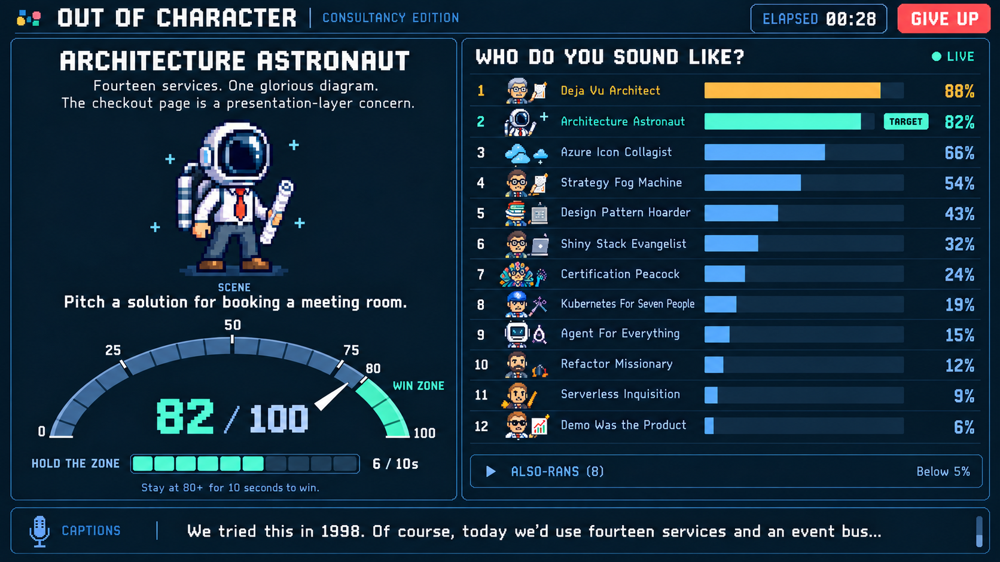

# Out of Character

A party game about the characters you meet in a tech consultancy. Draw from the curated 42-character cast, improvise through a generated scene, and earn **10 consecutive Jev scores in the 80–100 win zone** to win. **Give up** ends the turn.

Targets desktop Chrome on macOS and iOS Safari. [Open the game](https://outofcharacter.droopy.dev) or [explore the component workshop](https://outofcharacter.droopy.dev/storybook). See [implementation status](docs/solutioning/implementation-status.md) for verified browser behavior and remaining physical-device checks.



```sh
bun install
bunx wrangler d1 migrations apply SIMULATOR_ARCHIVE --local
bun run dev
bun run check
bun run deploy
```

Keep the Cloudflare Vite plugin and Wrangler on compatible runtime versions when updating either dependency. They share local storage under `.wrangler/state`; using an older runtime after a newer one can cause an alarm-table schema error. Align the tooling before resetting local data.

For local paid services, copy `.dev.vars.example` to the ignored `.dev.vars` and provide `TYPESAFE_API_KEY`, `AZURE_OPENAI_API_INSTANCE_NAME`, `AZURE_OPENAI_API_KEY`, `AZURE_OPENAI_AGENT_MODEL`, and `AZURE_OPENAI_FAST_MODEL`. All Luna and Sol requests use the AI SDK Azure provider or the same Foundry Responses endpoint. GPT-Live uses Foundry's WebRTC and control WebSocket endpoints; its deployment defaults to `gpt-live-1`, with an optional `AZURE_OPENAI_LIVE_MODEL` override. Jev continues to use TypeSafe. Cloudflare-hosted Deepgram Flux handles streaming transcription through the Worker AI binding. No separate speech API key is needed. Deployment uses the dedicated personal-account Worker in `wrangler.jsonc`; configure the same values on the target Worker and retain `PAID_SERVICES_ENABLED=true` to enable paid requests.

`bun run check` runs typecheck, tests, build, and a Wrangler deployment dry run. `bun run eval:jev --mode=both` is an opt-in paid Noul/Score comparison over saved synthetic fixtures. Gameplay combines full-transcript Noul probabilities (70%) with recent-20-second probabilities (30%). The workshop includes interactive composite controls and stored Noul/Score results.

The workshop lets you replay the draw and reel, inspect the flat cast, backstories, and active judge-facing descriptions, adjust the gauge and score streak, expand the character race, replay performance and silence, preview the final top 10 and highlighted transcript, and compare saved Noul/Score readings. Its fixtures use the real presentation components without microphone access or paid requests.

## Branch previews

`bun run deploy:preview --name project-closeout-interviews` updates the branch's [Cloudflare Worker Preview](https://developers.cloudflare.com/workers/previews/) without changing the production deployment or custom domain. The `previews` block in `wrangler.jsonc` provides separate transcript storage and rate limits; Cloudflare isolates each preview's live session objects. This branch uses the `out-of-character-interview-preview` D1 database. Apply new migrations to that database before updating the preview.

[Try The Debrief preview](https://project-closeout-interviews-out-of-character.droopy.workers.dev/interview).

The preview has its own `TYPESAFE_API_KEY` and Foundry configuration; subsequent deployments retain them. Use `wrangler preview secret bulk <file> --name project-closeout-interviews` to update preview secrets, or `--secrets-file <file>` with the preview deployment to upload them together. A new preview needs those values provisioned separately. Preview pages are public, while transcripts and summaries retain the session capability protection. Production releases still use `bun run deploy`.

**Required when merging this branch into main:** before deploying the merged code, set the Foundry values on the production `out-of-character` Worker too. Preview secrets are separate and do not transfer to production. Set `AZURE_OPENAI_API_INSTANCE_NAME`, `AZURE_OPENAI_API_KEY`, `AZURE_OPENAI_AGENT_MODEL`, and `AZURE_OPENAI_FAST_MODEL` from the configured local environment, plus `AZURE_OPENAI_LIVE_MODEL` if overriding `gpt-live-1`. Copy `AZURE_OPENAI_EMBEDDING_MODEL` as well to retain the configured project values, although this app currently makes no embedding calls. Retain production's `TYPESAFE_API_KEY` for Jev. Use `wrangler secret bulk <file> --name out-of-character` for this future production update; the `wrangler preview secret` commands affect only previews.

Before that main cutover, record the intended Live deployment and moderation policy. The policy belongs to the Azure model deployment: using this preview's resource and `gpt-live-1` for production would also use its current `out-of-character-live-permissive` policy. Cloudflare secrets do not select or reset that policy. The preview policy adjustment does not authorize a production deployment.

## Running the reference host

The interview engine (`interview-engine/`) does not depend on Cloudflare. `scripts/interview-host.ts` hosts it in one Bun process to prove that: it serves the same `/api/interview/...` routes and replies as the Worker's `InterviewObject`, with the engine's in-memory seams in place of Durable Object storage, alarms and D1.

```sh
bun --env-file=.dev.vars scripts/interview-host.ts
```

It reads the same Foundry and `TYPESAFE_API_KEY` values as the Worker (Bun also loads `.env`) and listens on `http://127.0.0.1:8788`; set `PORT` or `HOST` to change that. Attempts live only in the process: wakes are timers, background work runs inline, and archive rows are kept in memory. Set `INTERVIEW_ARCHIVE_DIR` to also write each attempt's latest row there as JSON. Requests need the same `Origin` and `Authorization: Bearer <64 hex>` capability headers as the Worker's routes. The host serves no pages; on the Worker, the interview screens use these `/api/interview/sessions` routes.

## The Simulator

`/simulator` adds serious sales and consultancy practice. Choose one of nine scenarios and seven reusable client personalities, then talk to GPT-Live 1. Jev updates seven skills and objectives that can be achieved in any sequence. It also detects when contextual coaching or actor direction could help. GPT-6 Sol then generates specific advice from the dialogue. The client pursues its own interests and respects hidden budget, scope, and approval constraints. After scored practice, GPT-6 Sol with medium reasoning writes a concise, streamed coaching report from the full dialogue, provisional Jev assessment, and delivered advice. Jev scores and objectives appear immediately; validated Sol judgments replace them together when the report finishes. Happy Hour and the Voice Lab remain ungraded. `/simulator/voice-lab` plays a prepared sample for any client and GPT-Live voice while showing the portrait, character profile, sample text, and voice description. The lab needs no microphone or practice session. Preview which clips need recording with `bun scripts/voice-lab-samples.mjs --dry-run`; generate them with `bun --env-file=.dev.vars scripts/voice-lab-samples.mjs --paid`.

For local voice practice, configure Foundry in the ignored `.dev.vars` alongside `TYPESAFE_API_KEY`, and set `SIMULATOR_ENABLED=true` and `PAID_SERVICES_ENABLED=true`. Scored practice uses Jev to detect coaching opportunities and the configured Sol deployment to generate trainee hints and private actor directions. The deployment configuration enables live practice; the Worker needs the same Foundry values and TypeSafe key. Attempts can last up to sixty minutes; practice warns after three minutes of inactivity and closes after five. Muting does not stop the paid session; use **End session**.

Live attempts save transcripts, scores, selected client/scenario, release provenance, final reports and generation audit records privately in Cloudflare D1 for improving the simulator. Saves are best effort; a database failure does not interrupt practice. Audio is not archived. Before local practice, run `bunx wrangler d1 migrations apply SIMULATOR_ARCHIVE --local`; the local database is separate from production. The workshop uses fixtures and writes no archives. Authenticated developers can list and export attempts with `bun scripts/simulator-transcripts.ts list` and `bun scripts/simulator-transcripts.ts export <attempt-id>`. See [transcript review and retention](docs/solutioning/simulator-transcript-review.md) for access, recovery limits and deletion commands.

The simulator workshop includes these previews:

- `/storybook/simulator-selection`: scrollable collections, character changes, connection availability, and microphone errors.
- `/storybook/simulator-live`: replay, pause, seek, and reset recorded dialogue, animated objectives, hints, skill bars, and connection states.
- `/storybook/simulator-voice`: client/trainee/overlap spectra, connection states, intensity, pause/reset/replay, and reduced motion.
- `/storybook/simulator-voice-lab`: the Voice Lab with prepared clips, portraits, and client profiles.
- `/storybook/simulator-debrief`: completed coaching, final grades, and source quotations.
- `/storybook/simulator-report-compiling`, `/storybook/simulator-report-writing`, and `/storybook/simulator-report-failed`: report generation, streaming, retry/status failures, missing readings, interrupted and ungraded examples. Use **Replay generation** to see the full transition without a paid request.
- `/storybook/simulator-judging`: authored transcripts, stored real Jev judgments, source evidence, and historical raw distributions. Opening any story uses no microphone or paid API.

See [the five report design iterations](docs/solutioning/simulator-report-design-review.md) and [the report implementation and verification](docs/solutioning/simulator-final-report-plan.md). Run `ACCEPTANCE_URL=http://127.0.0.1:5175 node scripts/simulator-report-acceptance.mjs` against the local dev server to verify the report UI with substituted paid boundaries.

Use **Screen only** to compare each screen with the mockup without workshop controls. The live voice display uses real frequency analysis; the workshop uses clearly labeled deterministic samples. See [the two design iterations](docs/solutioning/simulator-design-iterations.md) for responsive and motion evidence.

Explicit paid recordings use `bun run eval:simulator`, `bun run eval:simulator --replay`, or `bun run eval:simulator --holdout`. The last command runs independently authored challenge cases and exits nonzero when an expectation is missed; retain those results when assessing rubric changes. These are synthetic examples, not validated personnel assessments.

See [simulator acceptance](docs/solutioning/simulator-acceptance.md) for reproducible browser/audio commands and evidence, [the implementation plan](docs/solutioning/simulator-implementation-plan.md) for architecture, and [the scenario framework](docs/solutioning/simulator-scenario-framework.md) for authoring more exercises.

## The Debrief

`/interview` is a project-closeout conversation with Sam. After a brief project introduction, Sam follows firsthand experiences, wins, frustrations and lessons across the project, the client, and the delivery team. Jev shows participant readings out of four and topic coverage with probabilities: not yet, touched, explored, or set aside. GPT-6 Sol keeps a map of what the participant has said and the threads still open, and can request public background from GPT-6 Luna. Jev ranks the open threads after each participant turn, and Sam receives private notes: the threads worth pulling and what is known so far. Participant boundaries and worthwhile stories take priority over completing every topic.

After End, GPT-6 Sol with medium reasoning streams an internal summary through the same report lifecycle as the simulator. Only completed, validated text is copyable and saved; a failed attempt offers one explicit retry. The transcript is saved independently in the private interview table. Leaving the screen cancels unfinished summary generation.

Use `/storybook/interview-summary` and **Replay stream** to preview preparing, writing and completed states without a paid call. `ACCEPTANCE_URL=http://127.0.0.1:5174 node scripts/interview-summary-acceptance.mjs` checks the real screen and streaming hook with substituted provider boundaries. See [the streaming plan](docs/solutioning/interview-streaming-plan.md) and [progress](docs/solutioning/interview-progress.md).

`/storybook/interview-judging` shows recorded synthetic Jev probabilities and producer decisions. `/storybook/interview-timeline` interleaves dialogue, producer consultations, research and coverage notes; it can load an interview archive JSON file locally without uploading it. The same timeline is available with `bun scripts/interview-timeline.ts <archive.json>`.

- [Product requirements](docs/solutioning/consultancy-party-game-prd.md)
- [Technical design](docs/solutioning/out-of-character-tech-design.md)
- [Measured Jev spike](docs/solutioning/jev-spike.md)
- [Curated character library](docs/consultancy-party-game-characters.md)
- [All 42 artwork prompts and provenance](docs/character-art-prompts.md)
- [Approved desktop draw composition](docs/mockups/out-of-character-character-draw-v6-prompt.md)
- [Third-party source notices](THIRD_PARTY_NOTICES.md)
