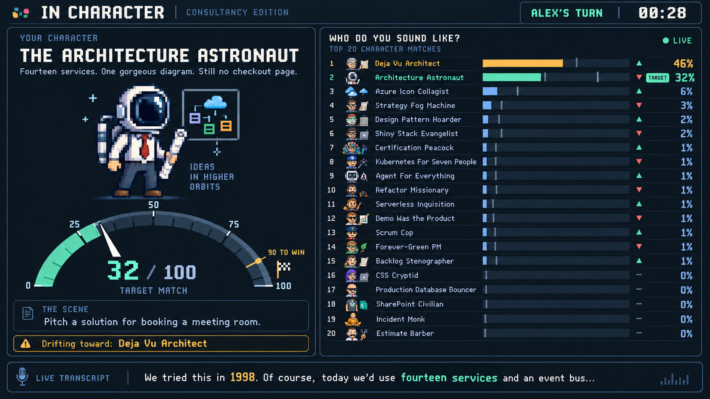

# Consultancy party game: gameplay concept prompt

September 17, 2026 · Version 1

This is a static concept image, not an implemented gameplay screen. The 90/100 win threshold and live ranking reflect the latest gameplay direction; scoring thresholds and actual inference cadence remain to be tuned.



## Exact generation prompt

```text
Use case: ui-mockup.
Asset type: a single high-fidelity desktop gameplay concept image for an actual consultancy party game, displayed on a shared big screen.
Primary request: Design a polished, delightful arcade-inspired game screen using charming original 8-bit pixel-art character avatars. Flat straight-on screenshot of the UI, wide landscape 16:9 composition, high resolution with crisp readable typography. No monitor frame, no photographed room, no laptop, no people outside the game UI. This is a functional game screen, not a marketing landing page.

Game title in a restrained top header: "IN CHARACTER", small subtitle "CONSULTANCY EDITION". Right header: "ALEX'S TURN" and "00:28".
Visual style: dark charcoal/navy background, warm off-white clean readable UI typography, mint/cyan for the assigned target, amber for a leading rival, subtle pixel-art borders and arcade number typography. Sophisticated indie arcade game, generous spacing and clear hierarchy, playful rather than enterprise dashboard. Pixel avatars have real hard square pixels, not smooth cartoon portraits; use office clothing and role-specific props. Flat background, no gratuitous gradients, no excessive neon glow or floating 3D glass.

Main layout: left approximately 43% of screen is the target-character stage. Right approximately 57% contains a tall ranked horizontal bar chart, with exactly 20 compact but legible rows, all visible, each with its own distinct tiny pixel avatar, character name, relative-length filled bar, and percentage. A shallow transcript strip spans the bottom.

LEFT TARGET STAGE:
Small label "YOUR CHARACTER".
Large legible title "THE ARCHITECTURE ASTRONAUT".
A large, delightful 8-bit full-body consultant avatar: a tiny space helmet, business shirt and tie, holding a rolled architecture diagram, surrounded by just two or three miniature diagram-node pixels. Not a real astronaut photograph.
Short backstory: "Fourteen services. One gorgeous diagram. Still no checkout page."
A very prominent semicircular speedometer below or behind the avatar, a thick segmented arc from 0 to 100 with readable marks 0, 25, 50, 75, 100. Needle correctly at 32 on the scale, mint fill covering exactly about the first third of the arc. Big numeric reading "32 / 100" with small caption "TARGET MATCH". Clearly show a thin gold threshold marker at 90 and small label "90 TO WIN". At the high end, a tiny finish flag makes the threshold easy to understand.
A scene card under the gauge, legible: small label "THE SCENE"; text "Pitch a solution for booking a meeting room."
An understated amber rival callout "Drifting toward: Deja Vu Architect".

RIGHT LIVE CHART:
Heading "WHO DO YOU SOUND LIKE?"
Small caption "TOP 20 CHARACTER MATCHES" and a tiny live status light labeled "LIVE".
Row percentages below are illustrative competing probabilities and sum to 100. Bar lengths must reflect those numbers against a shared 0-100 scale: the 46% bar is 46% of available track, 32% is 32%, and so on. Highlight the Architecture Astronaut row in mint with a small "TARGET" pill even though it is second; the Deja Vu Architect row leads in amber. All other bars subdued cool blue. Very small trend arrows and a couple of lightly ghosted previous bar-end markers imply constant live movement without blurring the text. Do not display global model confidence as these numbers.
Exactly these 20 rows in this order:
Deja Vu Architect — 46%
Architecture Astronaut — 32%
Azure Icon Collagist — 6%
Strategy Fog Machine — 3%
Design Pattern Hoarder — 2%
Shiny Stack Evangelist — 2%
Certification Peacock — 1%
Kubernetes For Seven People — 1%
Agent For Everything — 1%
Refactor Missionary — 1%
Serverless Inquisition — 1%
Demo Was the Product — 1%
Scrum Cop — 1%
Forever-Green PM — 1%
Backlog Stenographer — 1%
CSS Cryptid — 0%
Production Database Bouncer — 0%
SharePoint Civilian — 0%
Incident Monk — 0%
Estimate Barber — 0%
Give each row an appealing different 8-bit avatar: gray-bearded architect with old diagram, space-helmet consultant matching large target avatar, cloud-diagram presenter, strategy presenter with sticky note, pattern hoarder with stacked folders, gadget-loving developer, badge-covered consultant, cluster engineer, robot enthusiast, refactor coder, function engineer, demo salesperson, process cop, green-status PM, backlog note taker, colorful front-end coder, database bouncer, SharePoint configurator, calm incident responder, estimator holding scissors. These are fictional composites.

BOTTOM TRANSCRIPT STRIP:
Small pixel microphone icon and label "LIVE TRANSCRIPT". Text: "We tried this in 1998. Of course, today we'd use fourteen services and an event bus..."
Make "1998" amber and "fourteen services" mint, to visually connect the spoken words with the leading characters. This is visual illustration of the performance, not an automatic explanation claim.
Constraints: one coherent beautiful gameplay interface; visibly prioritize the target avatar and speedometer, while keeping the full 20-character chart readable. No web navigation menus, no stock photos, no marketing call-to-action, no watermarks, no invented brand logos. All text spelling and numbers accurate. Capture the fun moment when the player is trying to portray Architecture Astronaut but the judge currently favors Deja Vu Architect.
```
