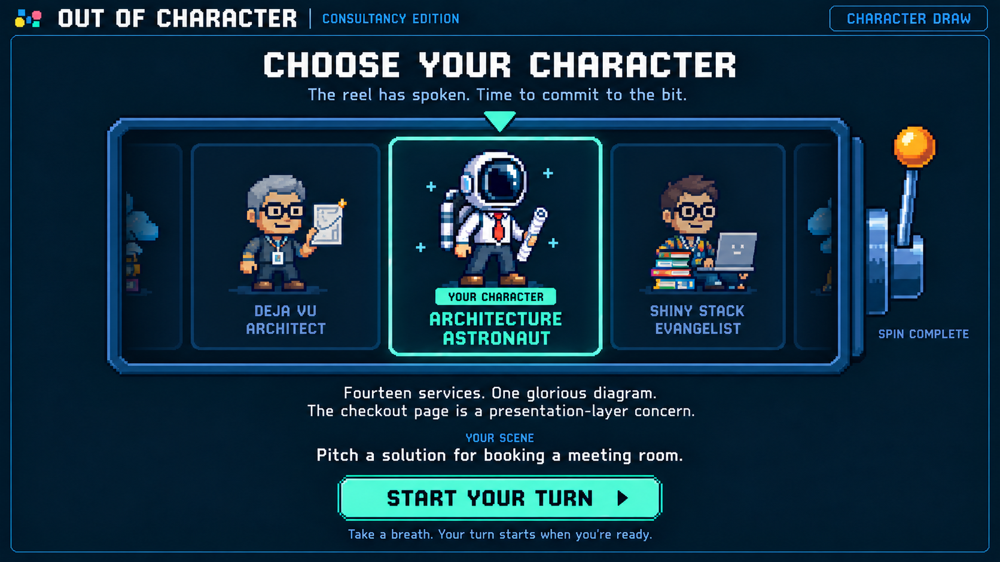

# Out of Character: character draw concept, version 1

September 18, 2026

[Gameplay mockup](out-of-character-gameplay-v3.png) · [Game PRD](../solutioning/consultancy-party-game-prd.md) · [Character seeds](../consultancy-party-game-characters.md)



A companion to the gameplay screen, using the same navy background, pixel typography, blue frames, consultant sprites, and mint highlights. This static mockup shows the reveal after the reel stops on Architecture Astronaut. The amber lever gives the draw a playful arcade feel.

## Proposed interaction

1. Before drawing, show a neutral center card, the instruction **Pull the lever to meet your character**, and a mint **Spin for a character** button. The lever and button trigger the same action.
2. Randomly assign one character from the fixed match deck. Animate a single horizontal strip of character cards beneath the stationary mint pointer for roughly 2–3 seconds, slowing before it settles on the assigned card. Neighboring cards are previews.
3. Highlight the assigned character in mint, dim its neighbors, and reveal its backstory and scene. The lever becomes inactive and reads **Spin complete**. One draw per turn; no reroll control in this concept.
4. Show **Start your turn**. The player can read the prompt before starting; the performance clock and microphone capture begin when they start their turn.

The screenshot depicts step 3–4. Animation timings are proposed design values, not implemented behavior. A reduced-motion version should reveal the selected card directly.

## Generation

Created with the built-in image generation tool, using the current gameplay-v3 image as the style reference. No application code or animation is implemented.

## Exact generation prompt

```text
Use case: ui-mockup.
Asset type: static high-fidelity character-selection screen for the Out of Character party game.
Input image: the supplied gameplay-v3 image is a STYLE REFERENCE, not an edit target. Create a NEW companion screen matching that exact game UI.
Primary request: a character draw screen with a playful slot-machine character reel and physical pixel-art lever. Show the moment AFTER the reel has stopped and randomly assigned Architecture Astronaut. This is a single full-screen game interface, not a montage, wireframe, annotated design board, or device mockup.

Style invariants: match reference wide 16:9 straight-on composition, near-black dark navy background, subtle blue edge illumination, thin cyan-blue beveled panel borders, crisp large white pixel display lettering, readable smaller mixed-case pixel text, brilliant mint selection accents, restrained amber lever accent. Match the original charming 8-bit consultant sprites. Keep the exact header game logo and title "OUT OF CHARACTER", divider and "CONSULTANCY EDITION", at upper left. The header right has a small subdued blue chip "CHARACTER DRAW". No gameplay timer, gauge, rankings, captions, surrender button or score.

Layout: generous margins, calm hierarchy, centered main content. Beneath the header, centered large white heading "CHOOSE YOUR CHARACTER". Smaller subdued blue-white subtitle "The reel has spoken. Time to commit to the bit." A spacious wide horizontal reel panel occupies the middle of the screen. It is ONE continuous reel of character cards, not three independently spinning gambling reels. A small mint downward triangular pointer above the middle card shows the landing position.
The middle selected card is larger and fully visible, crisp, framed in mint with very subtle mint glow and a small mint pill "YOUR CHARACTER". Its large charming pixel-art Architecture Astronaut sprite is the same identity as reference: office shirt, red tie, dark trousers, boots, round space helmet and a rolled architecture diagram. Give the sprite plenty of room. Below the sprite inside this card, clearly readable centered mint title on two tidy lines "ARCHITECTURE" / "ASTRONAUT".
On the left, a dimmed smaller neighbor card shows the gray-haired consultant sprite with glasses and a diagram, label "DEJA VU ARCHITECT". On the right a dimmed smaller neighbor card shows a young consultant with glasses and a laptop, label "SHINY STACK EVANGELIST". The neighbor cards are previews on the same horizontal strip, not selectable buttons. Include clipped outer card edges and subtle navy fade at the viewport edges to suggest a longer reel, without clipping names on the main three visible cards. No heavy motion blur in this settled frame.
To the right of the reel frame, a beautifully drawn pixel-art slot-machine lever mounted to the frame: steel blue stem, round amber handle, small blue base. Lever in resting position after drawing. Small muted caption underneath "SPIN COMPLETE". No active reroll button in the completed state. Machine should feel like the existing game interface, not a photoreal casino prop. No fruit, coins, jackpot labels, gambling metrics, or money.

Below the reel, a compact centered unboxed character backstory, exactly two lines:
"Fourteen services. One glorious diagram."
"The checkout page is a presentation-layer concern."
Then a small blue "YOUR SCENE" label and readable white text:
"Pitch a solution for booking a meeting room."
At bottom center a wide mint arcade button with dark navy chunky text "START YOUR TURN" and a small right-pointing pixel arrow. Smaller muted hint below "Take a breath. Your turn starts when you’re ready."
Enough breathing room between reel, backstory, scene and button. All elements fit visibly in one screen. Selected card and action dominate; side characters stay subdued. No extra paragraphs, settings, steps, navigation, repeated headings, mascots, watermark, external branding or device frame. Exact text legibility is essential.
```
