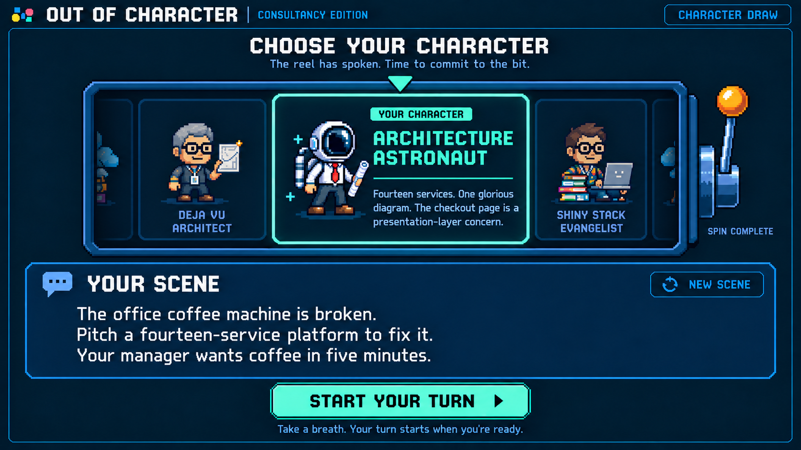

# Out of Character: character draw concept, version 2

September 18, 2026

[Gameplay mockup](out-of-character-gameplay-v3.png) · [Game PRD](../solutioning/consultancy-party-game-prd.md) · [Previous draw concept](out-of-character-character-draw-v1-prompt.md)



The selected character's name and backstory now share its mint card. A separate, prominent **Your scene** panel contains a short runtime-generated situation. **New scene** is a secondary refresh control; **Start your turn** remains the primary action.

The screenshot shows a completed draw with illustrative scene copy. The mockup was created with the built-in image generation tool; no runtime generation, animation, or game code is implemented.

## Draw and generation flow

1. Before drawing, show a neutral center card and **Spin for a character**. The button and lever trigger the same action.
2. On spin, randomly choose the character from the fixed match deck immediately. Start the reel animation and an LLM scene request together. The reel is a visual reveal of that chosen result; it does not determine a different result at the end.
3. Send the chosen character's name and backstory plus the last 20 used scenes to the LLM. Ask for a concise, playable situation that puts this character in a typical or funny predicament.
4. Animate the single horizontal character reel for roughly 2–3 seconds, slowing to the chosen card. If the scene finishes early, hold it until the reel lands.
5. Once the reel lands, reveal the selected character and backstory. Show the generated scene if ready. Otherwise show **Setting the scene…** inside the scene panel. Let the reel finish normally even if generation takes longer.
6. Enable **Start your turn** only after both the reel and a valid scene are ready. The player reads the situation at their own pace. Starting the turn begins the elapsed clock and microphone capture together.

The lever becomes inactive after drawing. The neighboring cards are previews, and refreshing the scene keeps the selected character unchanged. A reduced-motion setting reveals the chosen character directly while scene generation runs.

## Scene generation and variety

Use the chosen character's stable ID, name, and backstory, and the last 20 scenes actually used in play, ordered from oldest to newest. Include the character ID with each historical scene to give the generator context.

Ask for 2–3 short sentences, roughly 25–50 words: establish a situation, give the performer something concrete to do or explain, and add an audience, constraint, or comic complication. Vary settings, objectives, people, stakes, and types of conflict relative to recent scenes; changing nouns in the same recurring setup is insufficient. Alternate between natural situations for the character and funny situations that expose its habits. Do not supply example dialogue or a script.

Keep a rolling history in the shared browser, retained across matches on that browser. Record a scene once when **Start your turn** is accepted, then retain the newest 20 entries. Unshown results, failed requests, and scenes replaced before starting do not count as used scenes. This is recent-history guidance for variety, not a guarantee that an LLM will never repeat a theme.

## Refresh, loading, and retry

- **New scene** requests another situation for the same character and the same recent history. Also send the current displayed scene as a scene to avoid so refreshing does not immediately reproduce it.
- During generation or refresh, show **Setting the scene…**, disable **Start your turn**, and disable repeated generation requests. Refreshing does not animate the character reel again.
- If generation fails, show **Couldn't create a scene. Try again.** and a **Retry scene** action. Keep the character selected and the turn unstarted.
- Only the current turn's current scene request may update the panel. Ignore late results from replaced requests or previous turns.
- Once performance begins, freeze the selected scene and remove refresh controls. The scene remains player guidance and is excluded from character-judging evidence.

## Exact image edit prompt

```text
Use case: ui-mockup image edit.
Edit target: supplied Out of Character character-draw-v1 screen.
Create version 2 of this same screen. Preserve its wide 16:9 straight-on arcade UI, exact header logo "OUT OF CHARACTER" / "CONSULTANCY EDITION", top-right "CHARACTER DRAW" chip, dark navy background, thin blue frames, crisp pixel typography, lovely consultant sprites, ONE horizontal character reel with a stationary mint triangle, selected Architecture Astronaut in mint, subdued side characters, and amber slot-machine lever.
Main design goals: visibly couple the character backstory to the selected character; make the generated scene substantially more prominent and clearly separate. Capture a finished draw and finished scene, ready to start. This is a static app screen, no diagrams or annotation.

Refine vertical proportions to fit without crowding: reduce the height used by the screen heading and subtitle and by the reel's oversized sprites; dedicate a generous distinct scene panel across the lower area. Keep "CHOOSE YOUR CHARACTER" heading and subtitle "The reel has spoken. Time to commit to the bit." but slightly smaller than reference. No redundant headings.

REEL:
Keep continuous blue framed slot-machine viewport, clipped card edges indicating more characters, a left dimmed card labeled "DEJA VU ARCHITECT" with gray-haired bespectacled consultant and diagram, and right dimmed card labeled "SHINY STACK EVANGELIST" with bespectacled consultant and laptop.
Make the middle selected mint card wider than before to allow its backstory to fit comfortably. Inside that mint border place a compact "YOUR CHARACTER" badge, the charming Architecture Astronaut sprite with helmet, office shirt, red tie, dark pants, boots and rolled diagram, readable mint title "ARCHITECTURE ASTRONAUT", then a subtle dividing line and smaller blue-white mixed-case backstory EXACTLY:
"Fourteen services. One glorious diagram.
The checkout page is a presentation-layer concern."
Wrap it naturally into approximately 3–4 compact lines if necessary. Backstory is fully enclosed inside this selected character card, beneath its name. It MUST NOT appear outside the reel or in the scene panel. Both name and prose have good padding. Reduce sprite size moderately, preserving personality, to create room. Side cards remain subdued.
Preserve the steel-blue lever and round amber knob to the right of the reel; small subdued label "SPIN COMPLETE" beneath it. No character reroll button.

SCENE PANEL:
Below reel, create a separate broad navy panel with a clearly visible thin blue border, subtle brighter blue background than rest, spacious inner padding. At its upper left put a small pixel speech-bubble icon and prominent white heading "YOUR SCENE". At its upper right a small low-emphasis blue outline control with a circular refresh arrow and label "NEW SCENE". This is secondary to start; no mint fill on refresh.
The scene body is prominent, readable mixed-case white text, larger than character backstory, arranged across 2–3 comfortably spaced lines, exact:
"The office coffee machine is broken.
Pitch a fourteen-service platform to fix it.
Your manager wants coffee in five minutes."
This is sample runtime-generated copy for the selected character, not another backstory. No labels saying LLM, AI, prompt, token, generated or implementation jargon. No extra description.
Make scene panel feel like the next thing the player reads: strong grouping, clear hierarchy and room for a two- or three-sentence situation. It must not blend into the character card prose.

ACTION:
Below scene panel center a wide mint arcade button with dark text "START YOUR TURN" and a right-pointing pixel arrow. Keep understated hint below "Take a breath. Your turn starts when you're ready."
All header, reel, fully enclosed backstory, scene and action fit within canvas without cropping or overlap. Generous but efficient spacing, no extra footer sections, timers, meters, rankings, casino objects or watermarks. Matching reference visual language and accurate legible text are essential.
```
