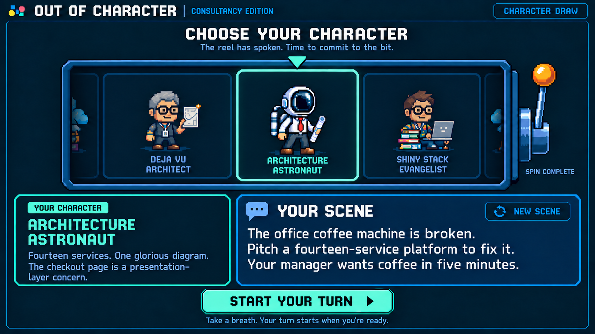

# Out of Character: character draw concept, version 3

September 18, 2026

[Gameplay mockup](out-of-character-gameplay-v3.png) · [Game PRD](../solutioning/consultancy-party-game-prd.md) · [Previous draw concept](out-of-character-character-draw-v2-prompt.md)



This revision separates the moving reel from the character details. Reel cards contain only a sprite and name. Stationary panels below the reel couple the selected character's name with its backstory and give the scene a separate, larger reading area.

The screenshot depicts the ready state. Created with the built-in image generation tool; this is a static concept, not a verified animation or runtime implementation.

## Animation and layout contract

- Every reel card has the same width, height, sprite area, and two-line name area. Backstories never appear in moving cards, including cards passing through the center.
- The mint pointer and selection outline are stationary overlays. Selection does not resize a card, add content, or change spacing. Animate only the horizontal translation of the card strip.
- Reserve the character-details panel, scene panel, and action area from the initial screen onward. Their geometry stays the same before spinning, during spinning, after landing, during scene refresh, and on errors.
- Before spinning, the details panel says **Your character appears here** and the scene panel says **Your scene appears here**. During the spin, they say **Choosing your character…** and **Setting the scene…**. Do not cycle either panel through passing characters.
- After landing, fade in only the assigned character's name and backstory within the reserved details panel. Reveal the scene when both landing and generation are complete. If generation is still pending, retain the scene panel's loading text.
- Accommodate variable backstory and scene lengths inside the panels without expanding the page: wrap text within the reserved area, with internal scrolling if necessary. Do not truncate the playable scene or move the start action.
- Keep the action's footprint fixed: **Spin for a character** before the draw, disabled **Spinning…** during it, and **Start your turn** afterward, disabled until the scene is ready. Refresh and retry controls also stay within the scene panel's reserved header area.

These are intended implementation constraints; the generated bitmap illustrates their visual arrangement.

## Draw and runtime scene flow

1. Pulling the lever or pressing **Spin for a character** chooses a random character from the fixed match deck immediately.
2. Start the reel animation and a scene-generation request together. Send the chosen character's ID, name, and backstory, plus the last 20 played scenes and their character IDs.
3. Animate toward that predetermined result for roughly 2–3 seconds. If scene generation finishes first, hold its reveal until landing; let the reel finish normally if generation takes longer.
4. Reveal the character details after landing and the scene when ready. Enable **Start your turn** only when both are ready.
5. **New scene** generates another situation for the same character, using played history and the current scene as something to avoid. The character, reel, and panel sizes stay unchanged.
6. Starting freezes the scene, removes refresh controls, records the scene once in played history, and starts the performance clock and microphone capture together.

The lever is inactive after drawing. Keep the newest 20 played scenes in the shared browser across matches. Unshown results, failed requests, and replaced scenes do not count as played history. Diversity guidance asks for varied settings, objectives, audiences, stakes, and conflicts, rather than shallow rewording.

Generate 2–3 short sentences, roughly 25–50 words, that place the chosen character in a typical or funny predicament and give the performer a concrete task and complication. Do not provide example dialogue or a script.

Disable repeated generation requests and starting while generation is pending. On failure, show **Couldn't create a scene. Try again.** and **Retry scene** inside the same reserved panel. Only the current turn's current scene request may update it. Scene text is player guidance and remains excluded from character-judging evidence.

For reduced motion, reveal the chosen character without translating the reel; keep the same scene-loading and readiness behavior.

## Exact image edit prompt

```text
Use case: ui-mockup image edit.
Edit target: supplied Out of Character character-draw-v2 screenshot.
Create version 3 of the SAME screen, preserving the exact wide 16:9 straight-on crisp pixel-art arcade style, navy backdrop, blue beveled borders, mint selection accent, amber lever and sprites, header "OUT OF CHARACTER" / "CONSULTANCY EDITION" and "CHARACTER DRAW", heading "CHOOSE YOUR CHARACTER", subtitle "The reel has spoken. Time to commit to the bit.".
Fix the layout so it is easy to animate without any card resizing or text changing as cards pass the selection position. Show the finished reveal state.

REEL DESIGN:
A blue framed horizontal viewport across upper-middle, with three fully visible equal-size character cards and clipped outer card edges suggesting a longer strip. ALL three cards have IDENTICAL width, height and inner layout. Each card contains ONLY a centered pixel character sprite above its centered two-line name. No card contains backstory, prose, subtitle, badge, or extra content. All sprites occupy identical-sized areas and all names occupy identical-sized two-line areas.
Left card: gray-haired consultant with glasses and diagram, name "DEJA VU" / "ARCHITECT".
Middle card: charming helmeted office astronaut with red tie and rolled diagram, name "ARCHITECTURE" / "ASTRONAUT".
Right card: young consultant with glasses and laptop, name "SHINY STACK" / "EVANGELIST".
The center selection is indicated by a stationary mint outline overlay exactly the same dimensions as a card, with a mint triangle centered above it. Do NOT enlarge or widen the center card; outline doesn't change geometry. Side cards are subdued, center sprite bright. Keep original playful steel-blue slot-machine lever with amber knob on viewport right and subdued "SPIN COMPLETE". Moderately compact reel height to allow roomy information panels beneath.

STATIC INFORMATION AREA:
Below the reel place TWO SEPARATE side-by-side panels with equal height and aligned top and bottom edges, separated by a comfortable gutter. Together they span the screen content width. LEFT panel occupies about 35% of row; RIGHT scene panel about 65%.
LEFT character-details panel: navy fill, restrained mint border. Small mint heading "YOUR CHARACTER", below it clear mint title "ARCHITECTURE ASTRONAUT" over two tidy lines. Then compact readable mixed-case blue-white backstory:
"Fourteen services. One glorious diagram.
The checkout page is a presentation-layer concern."
Wrap neatly within the panel with good padding and space between title and prose. No sprite in this details panel. Character identity and description are coupled together here, separate from the moving reel.
RIGHT scene panel: slightly brighter blue-navy fill, distinct blue outline. Small speech-bubble icon with white heading "YOUR SCENE". Upper right small blue outline refresh control labeled "NEW SCENE" with circular arrow. Large readable white mixed-case scene body, larger than character backstory:
"The office coffee machine is broken.
Pitch a fourteen-service platform to fix it.
Your manager wants coffee in five minutes."
Wrap naturally across 3–4 balanced lines; preserve exact text, do not clip. Scene remains prominent and easy to read across a room. Ensure heading and refresh don't collide.
These panels are outside the reel and remain stationary throughout the animation; screenshot depicts completed text. Do not add annotations about implementation or animation. Clear strong separation between character details and scene, no floating prose between reel and panels.

ACTION:
Below the panels center a wide mint button "START YOUR TURN" with dark navy text and pixel arrow, then small subdued hint "Take a breath. Your turn starts when you're ready."
Everything fits visibly in one screen with crisp text, consistent padding, no overlap, no device frame or watermark. Most important invariant: three IDENTICALLY SIZED moving cards with ONLY sprite and name, and the backstory appears ONLY in the external stationary character-details panel. Maintain charming existing art direction.
```
