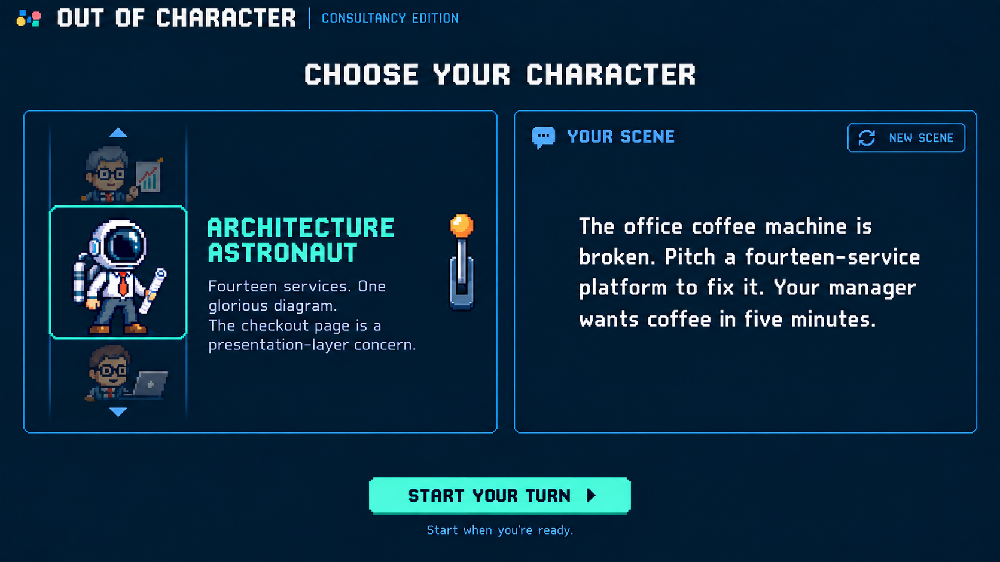
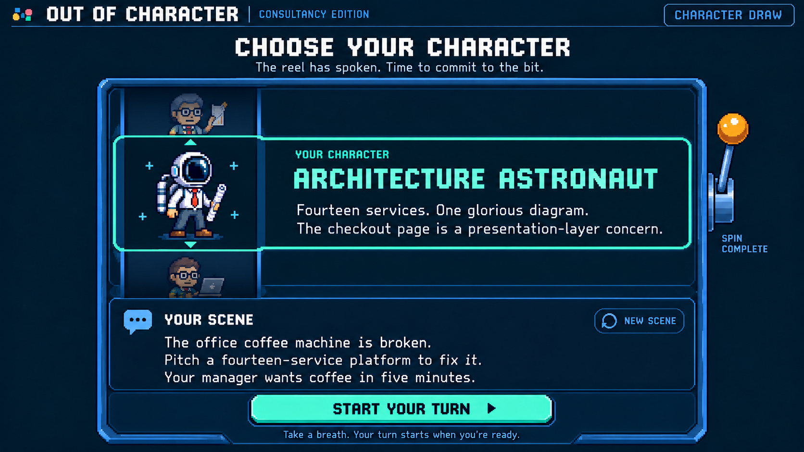
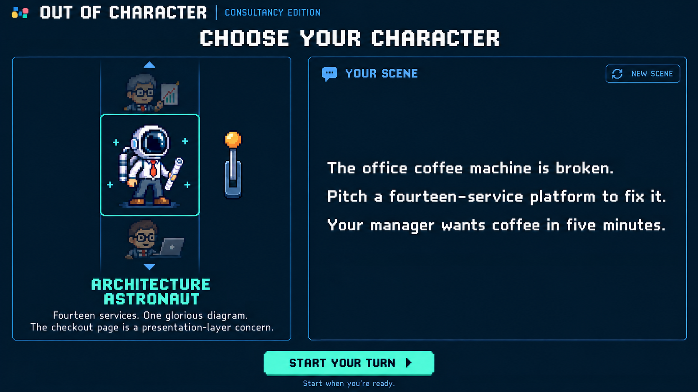

# Out of Character: character draw restart, version 5

September 18, 2026

[Gameplay mockup](out-of-character-gameplay-v3.png) · [Game PRD](../solutioning/consultancy-party-game-prd.md)



Version 4 was rejected. This starts from the gameplay screen's visual style and replaces the cabinet composition with independent character and scene sections and a standalone footer action. It is a desktop candidate, not an approved final design. Mobile remains deferred.

The left section groups a vertical sprite reel with a stationary name and backstory beside its landing window. The right section presents the scene. The start button sits on plain page background outside both sections. No **Your character** label appears in the reel or in the fixed details.

Created with the built-in image generation tool and inspected in two critique passes. This is a static mockup; animation, runtime scene generation, and mobile behavior are not implemented or verified.

## Motion and fixed content

- Only identical-size sprite tiles translate vertically inside the clipped reel viewport. No names, descriptions, or labels scroll with them.
- The mint landing outline is stationary and surrounds only the sprite opening. It never extends across the character prose or scene.
- The name and backstory stay outside that viewport and appear once, next to the selected sprite, after landing.
- Reserve character, scene, and footer areas before spinning. During spinning show **Choosing your character…** in the fixed details and **Setting the scene…** in the scene. Do not change details for passing sprites.
- Text reveal, loading, refresh, and errors replace content within reserved areas without moving the footer. Longer text wraps or scrolls within its area.
- Keep the footer action footprint fixed: **Spin for a character**, disabled **Spinning…**, then **Start your turn**, disabled until scene readiness. The lever and spin button invoke the same draw.

## Runtime scene behavior retained

Choose the random character from the fixed match deck as soon as spinning starts. Generate its scene while the visual reel animates toward that predetermined result. Send the character's stable ID, name, and backstory plus the last 20 played scenes and their character IDs.

Request 2–3 short sentences, roughly 25–50 words, describing a concrete situation, task, and funny complication or constraint. Vary settings, audiences, goals, stakes, and conflict relative to recent history. Use typical and funny situations for the character, without supplying dialogue or a script.

Hold early scene results until landing; if generation outlasts animation, finish the reel and retain the scene loading state. Starting requires both landing and a valid scene. **New scene** keeps the character and uses the current scene as something to avoid alongside played history.

Disable repeated generation requests and starting while pending. On failure, retain the character and offer **Retry scene** inside the same scene section. Accept only results from the current turn's current request. Starting freezes the scene, removes refresh controls, records it once in browser history of the newest 20 played scenes, and starts the microphone and elapsed clock together. Retain history across matches; replaced or failed scenes do not count as played. Scene text remains outside character-judging evidence.

Reduced motion reveals the selected sprite directly with the same scene-readiness behavior.

## Iteration 1

### Before screenshot



### Five critiques

1. The shared cabinet border encloses everything, making the scene and button read as machine contents. Remove that enclosing border.
2. The selected mint band spans the reel and prose, obscuring what moves. Confine the selection outline to the sprite opening.
3. Empty bands above and below the character title consume space without helping the reveal. Use a simple character section rather than cabinet compartments.
4. The oversized character title dominates a smaller scene area. Give the scene an independent, prominent reading area.
5. The start action sits inside the machine's bottom compartment. Move it onto the page background after an explicit gap.

### Changes applied

Rebuilt the composition from the gameplay style reference, with two independent sections and an external footer action.

### After screenshot



## Iteration 2

### Before screenshot


### Five critiques

1. The caption sits closer to the lower preview than the landed astronaut. Move fixed metadata beside the central landing window.
2. The tall sections create excessive unused space. Reduce the row height.
3. Scene sentences run nearly edge-to-edge as separate long lines. Use a narrower reading area with natural wrapping.
4. The large screen heading competes with the content. Reduce its size.
5. The start action nearly touches the sections' lower edges. Add a deliberate footer gap.

### Changes applied

Moved the caption alongside the selected sprite, shortened the row, narrowed scene text, reduced the heading, and separated the footer action. In the final bitmap the lever remains within the character section's right edge; it is outside the scrolling viewport and does not overlap prose.

### After screenshot


## Exact generation prompt

```text
Use case: ui-mockup.
Generate a completely NEW desktop character selection screen for Out of Character. Use the supplied GAMEPLAY screenshot only for visual style, not composition. No reference to a slot-machine cabinet design. Start from a clean layout.
Flat straight-on landscape 16:9 app UI, same dark navy, subtle blue borders, crisp pixel art and restrained mint/amber as reference. Preserve top-left tiny multicolor pixel icon, "OUT OF CHARACTER", divider, "CONSULTANCY EDITION". Small blue display type. Main heading "CHOOSE YOUR CHARACTER" centered below header, moderately sized; no extra slogans, subtitle, status chip or turn timer.

COMPOSITION: two well-proportioned columns, large quiet negative-space gutter between them. Left roughly 42% width is a coherent character section. Right roughly 58% width is a clearly separate spacious scene section. Under BOTH columns, separated by at least 45 pixels of clear empty navy background, one global mint "START YOUR TURN" button. Do not enclose the columns or button in a shared cabinet, machine window, border, plinth or device. The whole page should be restrained and thoughtfully designed, not an ornate casino prop.

LEFT CHARACTER SECTION:
One subtle thin blue rectangular panel, about 570px wide and 600px high on a 1672x941 canvas. Panel has a vertical sprite reel in its upper portion and FIXED character caption in its lower portion. Integrated quiet matte navy panel surface; strong proximity between selected sprite and its caption; no detached information tile.
The vertical reel itself is a narrower tall clipped viewport centered in the upper portion, roughly 300px wide and 365px tall. A previous sprite is faintly partially visible at the top, next sprite faintly partially visible at bottom; centered selected sprite is large and fully visible. Show gray-haired bespectacled consultant and chart cropped above, young bespectacled consultant and laptop cropped below, with soft navy fading. Selected original pixel Architecture Astronaut stands centered with round space helmet, office shirt and red tie, trousers, boots, rolled diagram. All reel tiles are SPRITES ONLY. NO NAMES, NO LABELS, NO "YOUR CHARACTER", NO DESCRIPTIONS inside the reel viewport. One stationary mint thin outline around the middle landing opening; no horizontal overlay stretching into other sections, no mint rectangle wrapping prose. The reel visibly implies vertical movement.
A modest steel-blue slot lever with small amber knob is mounted immediately to the RIGHT of this narrow reel, inside left character section's allocated space. It is smaller than the character sprite, an accent, not a giant focal point. No lever labels, no "SPIN COMPLETE".
Directly beneath the reel, a FIXED caption on the SAME left panel surface, centered, separated by around 20px spacing. Readable mint name "ARCHITECTURE ASTRONAUT" on two short tidy lines. Medium size, not huge display competing with scene. Under name, smaller blue-white backstory EXACT:
"Fourteen services. One glorious diagram.
The checkout page is a presentation-layer concern."
Wrap cleanly across 2–3 lines; enough padding. This caption is outside the scrolling viewport and remains stationary. No "YOUR CHARACTER" label anywhere, no duplicate name in reel, no extra boxes around caption.

RIGHT SCENE SECTION:
Clearly independent thin blue frame with subtly brighter navy fill; it does not touch or overlap reel or its left character panel. Comfortable 55px gutter from left section. Equal top alignment and approximate overall height with left section.
Small blue heading "YOUR SCENE" at top left, small subdued blue outline "NEW SCENE" refresh control at top right, generous padding.
Prominent, mixed-case readable white text, larger than backstory but not huge, three short sentences with natural balanced wrapping and roomy line spacing:
"The office coffee machine is broken.
Pitch a fourteen-service platform to fix it.
Your manager wants coffee in five minutes."
The body is vertically comfortably centered in the scene's open reading area, with no cartoon props or placeholder icons. The scene should feel like the task the player reads next, and visually distinct from character prose. Optional very subtle small speech-bubble glyph beside heading, not oversized.

GLOBAL ACTION:
Outside all panel borders below the two-column row, after a visible generous gap, center a mint rectangle "START YOUR TURN" with dark pixel text and small right arrow. Standalone page action, absolutely NOT inside slot window or any cabinet. Small subdued hint below "Start when you're ready." Clear page bottom margin.

Selected/revealed state only. Good hierarchy, compact original 8-bit charm, mostly quiet navy. Important animation distinction: only sprite tiles scroll inside left narrow viewport; name and prose are outside the viewport and appear only once, below it. No floating overlays, no ornate thick machine casing, no shared cabinet, no arrows pointing between columns, no huge heading or giant lever, no per-character text within reel, no watermarks or device frame.
```

## Exact refinement prompt

```text
Edit this new Out of Character character-draw screen. Preserve its clean independent character and scene columns, dark navy, restrained thin blue frames, mint selected astronaut and button, original sprites, exact game header. This is a targeted second critique pass, no big arcade cabinet.

Fix five visual problems:
1. Caption below the whole vertical reel is ambiguously closer to the lower preview. Put the fixed character name and backstory immediately TO THE RIGHT OF THE CENTER LANDING SPRITE inside the left character section, vertically aligned with the chosen sprite. Do not put metadata inside the reel. Nothing except sprite tiles scrolls.
2. The panels are excessively tall. Shorten the scene and character sections to about 500px tall; vertically center the smaller row in available screen space, preserving a generous footer gap.
3. The scene's three isolated lines stretch almost to its right edge. Use comfortably padded, mixed-case text in a slightly narrower reading area, natural wrapping into about 5 lines with consistent line-height rather than three giant widely-separated single lines.
4. Reduce "CHOOSE YOUR CHARACTER" heading around 15% and ensure balanced spacing below header and above panels.
5. The start button is too close to the frame bottom. Keep a generous 60–70px blank navy gap between panel row and standalone action, and a clear bottom margin beneath its hint.

NEW LEFT SECTION INTERNAL LAYOUT:
Thin blue outer panel roughly 680px wide. Vertical SPRITE-ONLY reel in its left 40%, stationary name/backstory in its right 60%. Reel viewport only about 320px tall, with full center selected astronaut and small cropped fading preview at top and bottom. Do not give previews large full cards. ALL reel tiles same dimensions; selection outline fixed around center sprite opening only.
Fixed name at right center in mint, tidy two-line "ARCHITECTURE" / "ASTRONAUT", medium text, no "YOUR CHARACTER" label. Fixed compact prose directly under it:
"Fourteen services. One glorious diagram.
The checkout page is a presentation-layer concern."
Prose smaller subdued blue-white, neatly wrap across 4–5 short lines if necessary. Close proximity to selected sprite at same height makes identity clear. Name NOT below lower ghost and NOT repeated. No mint frame around prose or spanning across viewport.
Lever: compact steel stem with amber knob at outer RIGHT edge of LEFT character section, positioned in the navy gutter between sections. Small scale, no text, does not overlap prose or scene. Allocate enough gutter so lever doesn't touch scene border.

RIGHT SCENE SECTION:
Separate blue outline panel aligned to left section with generous gutter, small heading "YOUR SCENE" and small outline "NEW SCENE" with refresh arrow. Clearly separate from reel, no shared casing, no overlays.
Scene EXACT text, larger than character prose, readable white mixed case, comfortable balanced wraps:
"The office coffee machine is broken. Pitch a fourteen-service platform to fix it. Your manager wants coffee in five minutes."
Do not rewrite copy, do not add more content. Vertically center reading text in panel content area with intentional breathing room. Header and refresh remain top aligned.

GLOBAL FOOTER ACTION outside both panels on plain navy:
Wide mint "START YOUR TURN" with dark pixel lettering + right arrow, small hint "Start when you're ready." beneath. Clearly independent of slot machine, after wide empty gap.
No extra slogans, cabinet borders, machine plinth, ornate border, per-character labels in reel, huge lever, or extra elements. Same 16:9 original style.
```
