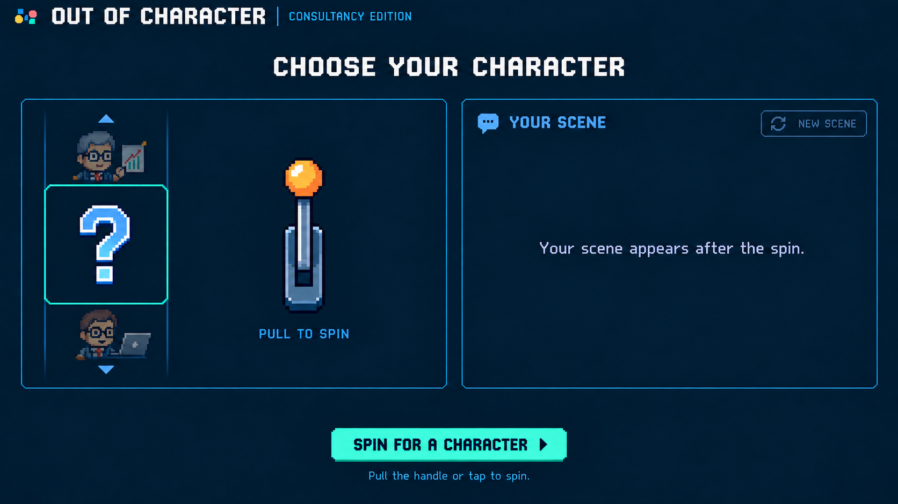
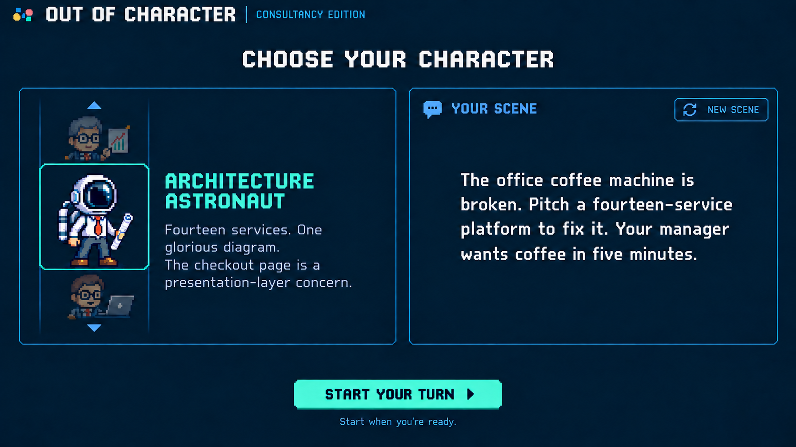

# Out of Character: shared handle and details, version 6

September 18, 2026

Approved desktop character-selection design · Approved by Andrew on September 18, 2026. These before-spin and after-landing mockups are the implementation reference; earlier versions are design history. Mobile composition remains deferred.

[Gameplay mockup](out-of-character-gameplay-v3.png) · [Game PRD](../solutioning/consultancy-party-game-prd.md) · [Previous draw concept](out-of-character-character-draw-v5-prompt.md)

The handle and selected character details now occupy the same fixed area beside the vertical sprite reel. They appear at different times. The character section, scene section, and standalone footer retain their geometry throughout.

## Before spinning



The handle is centered in the space that will later hold the selected name and backstory. The reel shows a mystery tile and previews. Scene refresh is inactive, and the footer offers **Spin for a character**.

## After landing



The handle disappears entirely. The selected name and backstory use the same reserved area beside the landed sprite. There is no separate handle still taking up room at the panel's edge.

These are static desktop mockups created with the built-in image generation tool. Animation, runtime scene generation, and mobile behavior are not implemented or verified.

## State and transition contract

| State | Shared area beside reel | Scene area | Footer action |
| --- | --- | --- | --- |
| Before spin | Active handle and Pull to spin hint; no character details | Placeholder; refresh inactive | Spin for a character |
| Spinning | Handle remains visible but inactive; no character details | Setting the scene…; refresh inactive | Spinning…; disabled |
| Landed, scene pending | Character name and backstory; handle absent | Setting the scene… or generation error/retry | Start your turn; disabled |
| Landed, scene ready | Character name and backstory; handle absent | Scene and New scene control | Start your turn; enabled |
| Scene refresh pending | Character details stay; handle remains absent | Setting the scene…; repeat refresh disabled | Start your turn; disabled |

On landing, fade the handle out, then fade the selected name and backstory into the same fixed area. A brief sequential fade avoids overlapping the handle and prose. Do not animate panel dimensions, swap in descriptions for passing sprites, or move the reel or footer.

Only identical-size sprite tiles move vertically through the reel's clipped viewport. Its mint landing outline remains stationary. Name and backstory never enter that viewport. Allow longer text to wrap or scroll inside its reserved area.

## Runtime scene behavior retained

On spin, choose the random character immediately from the maintained consultancy cast, initially all 100 characters, and start generating its scene while the reel animates toward that predetermined result. Send the character's stable ID, name, and backstory with the last 20 played scenes and their character IDs.

Request 2–3 short sentences, roughly 25–50 words, describing a concrete situation, a task, and a constraint or funny complication. Vary settings, audiences, goals, stakes, and conflicts; use typical and funny situations for the chosen character without supplying dialogue or a script.

Hold an early scene result until landing. If generation takes longer, reveal character details after landing anyway and retain the scene loading state. Enable starting only after both landing and a valid scene.

**New scene** keeps the character and passes the current scene as something to avoid alongside played history. Disable repeated requests and starting while pending. On failure, retain the character details, keep the handle absent, and offer **Retry scene** in the scene area. Accept only results from the current turn's current request.

Starting freezes the scene and removes refresh controls. Once audio and transcription are ready, record the scene once in the browser's rolling history of the newest 20 played scenes and start the performance clock with audio submission. Retain history across attempts and visits; failed, unshown, or replaced scenes do not count as played. Scene text remains excluded from character-judging evidence.

Reduced motion swaps the handle for details immediately after the direct character reveal, preserving the same scene-readiness behavior. Mobile composition remains deferred.

## Exact after-landing edit prompt

```text
Use case: ui-mockup image edit.
Edit the supplied Out of Character screen with ONE scoped change: render the AFTER-SPIN state of a shared handle/details area.
Preserve the exact screen geometry, navy background, pixel style, game header, heading, left vertical sprite reel and selected astronaut, stationary mint landing outline, side previews, right scene panel, scene copy, New scene control, separate footer Start your turn button and hint. No redesign, no new enclosing cabinet or border.

Inside the left character section, the area to the RIGHT OF THE VERTICAL REEL is one reserved shared area. In this after-spin state the handle has disappeared completely and that area contains only the chosen character name and backstory. REMOVE the steel lever, base and amber knob entirely from the right edge of that section. Fill its old location with the matching plain navy surface, no trace or ghost outline of handle. Do not move or enlarge panels.
Keep selected name "ARCHITECTURE ASTRONAUT" in mint two lines, next to center selected sprite. Keep backstory:
"Fourteen services. One glorious diagram.
The checkout page is a presentation-layer concern."
Let backstory use the newly available width of the reserved area with balanced 3–4 short lines; it does not have to stop early to leave handle space. Calm readable text, no gigantic title. NO "YOUR CHARACTER" label.
Only sprite tiles belong to reel. Name and backstory remain stationary, outside reel. This image shows handle completely replaced by details after reel landing; both never appear together. Keep exact right scene text and footer unchanged. Same wide 16:9 dimensions, precise pixel UI, no device mockup, no annotations or watermark.
```

## Exact before-spin edit prompt

```text
Use case: ui-mockup image edit.
Edit supplied Out of Character version 5 screen to show BEFORE SPIN. Preserve exact pixel UI, 16:9 composition, panel geometries, positions, header, "CHOOSE YOUR CHARACTER" heading, thin blue borders, vertical sprite reel at left, separate right scene panel and standalone footer action on plain navy. This is the initial state of the same screen, not a redesign.

In left section, replace the entire stationary character NAME AND BACKSTORY region to the right of reel with a SINGLE pixel-art slot-machine handle, centered in THAT SAME region, roughly x550,y440 on a1672x941 canvas. The handle should now occupy the space used by character text, not sit cramped at far right edge. Stylish steel-blue mount and stem, round amber knob, approximately210px tall and70px wide. Small understated blue text "PULL TO SPIN" beneath it. Keep a calm navy surrounding area. REMOVE old far-right handle entirely so there is exactly ONE handle. NO character name, backstory, "Your character" text or selected details visible in this before-spin state. The handle/detail shared region stays outside reel.
The vertical reel has the same dimensions and stationary mint landing opening. Inside central opening replace the chosen astronaut with a charming large pixel question mark in subdued blue-white. Retain dim cropped sprite previews above and below. No names or prose in reel. This is a mystery before drawing, not an already chosen character.
Right panel: preserve "YOUR SCENE" heading and speech bubble. Make "NEW SCENE" outline control subdued/disabled in same position. Replace actual coffee scene with small centered subdued blue-white placeholder "Your scene appears after the spin." No actual generated scene yet. No new elements.
Footer same exact position/width: mint button "SPIN FOR A CHARACTER" instead of Start Your Turn. Hint below "Pull the handle or tap to spin."
Keep full panel sizes stable and all colors/typography style faithful. This image will be paired with a revealed state where the handle disappears and character name/backstory appear in that exact same reserved region. Do not show both handle and details simultaneously. No surrounding machine cabinet, no labels inside reel, no annotations or watermark.
```
