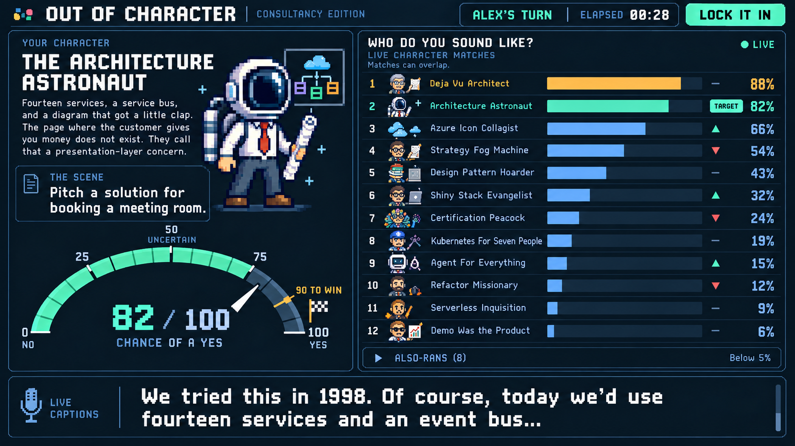

# Out of Character: gameplay concept, version 2

September 17, 2026

[Game PRD](../solutioning/consultancy-party-game-prd.md) · [Character seeds](../consultancy-party-game-characters.md)

This static concept uses independent per-character Noul judgments for both the target dial and ranked bars: target 82%, leading rival 88%. It shows the revised elapsed clock, Lock it in control, enlarged character and scene, plain live captions, and collapsed also-rans. Ninety is the provisional success threshold; a recent-window lock-in score and actual inference cadence still need playtesting. The original version remains available for comparison.



## Exact edit prompt

The version 1 gameplay image was the visual reference for this revision.

```text
Use case: ui-mockup image edit.
Edit target: the referenced existing pixel-art consultancy gameplay screenshot.
Primary request: Produce a carefully revised version of this exact gameplay interface, now titled "OUT OF CHARACTER". Preserve the dark arcade styling, pixel-art consultant identity, two-column composition, mint target accents, orange rival accents, and the segmented semicircular speedometer. This is a high-fidelity game-screen mockup, flat straight-on wide 16:9 screenshot, no device frame.

Important change to numerical semantics: BOTH dial and chart display INDEPENDENT yes/no probabilities, one TypeSafe Noul judgment per character, NOT a normalized Choice distribution. More than one character can have a high percentage and rows DO NOT sum to 100. Never mix scoring primitives in this screen. These percentages represent chance of a yes to "Does this performance portray this character?", not acting intensity. Explanatory user-facing caption can say "Matches can overlap." Do not expose API jargon in the main UI.

HEADER:
Replace "IN CHARACTER" with exact title "OUT OF CHARACTER"; keep "CONSULTANCY EDITION" smaller.
Keep "ALEX'S TURN".
Display a small clock with exact label "ELAPSED" and "00:28", clearly count-up, no time-remaining indicator.
Place an obvious attractive button "LOCK IT IN" beside the clock.
No Give Up button, no countdown bar, no intimidating time bomb.

LEFT COLUMN:
Keep the target stage and dial. Name "THE ARCHITECTURE ASTRONAUT" in prominent readable white pixel typography, allowing two lines.
Make the original astronaut-consultant sprite notably bigger: charming huge crisp square-pixel space helmet, business shirt and red tie, trousers, architecture blueprint in hand, same avatar identity as original.
Remove the decorative "IDEAS IN HIGHER ORBITS" filler copy.
Add exactly three punchy backstory sentences, readable in white:
"Fourteen services, a service bus, and a diagram that got a little clap. The page where the customer gives you money does not exist. They call that a presentation-layer concern."
Prioritize readability; do not reduce this to tiny microcopy.
Move the scene into a prominently weighted card near the character name, with scene text nearly as large as the character heading, significantly larger than the backstory. Small caption "THE SCENE", and big text "Pitch a solution for booking a meeting room." Use sensible line wrapping.
Keep the large segmented semicircular gauge with correct numeric scale 0, 25, 50, 75, 100. This version reads "82 / 100"; needle and mint fill must correspond to 82 on the arc, not 32. Keep gold threshold marker at 90, exact label "90 TO WIN", and checkered finish flag.
Caption directly under readout "CHANCE OF A YES"; small semantic labels "NO" at low end, "UNCERTAIN" near the midpoint, "YES" at high end. The midpoint means uncertainty, not halfway successful.
Completely DELETE the orange "Drifting toward" chip/banner and any similar rival callout in the left column. The right chart already shows drift.

RIGHT COLUMN: LIVE RACING BARS
Heading "WHO DO YOU SOUND LIKE?"
Caption "LIVE CHARACTER MATCHES"; small subcaption "Matches can overlap."
Keep status light "LIVE".
Change the dense 20-row chart into 12 visible, spacious racing rows, with bigger pixel avatars and readable names, clearly filled bars at correct independent values on a shared 0-100 horizontal scale. Convey smoothly changing ranks with restrained rank-change arrows and subtle previous-position marks, not motion-blurred text. This is a still frame of an animated bar race.
Use exactly these 12 rows and exact independent percentages, sorted descending:
1 Deja Vu Architect 88%
2 Architecture Astronaut 82%
3 Azure Icon Collagist 66%
4 Strategy Fog Machine 54%
5 Design Pattern Hoarder 43%
6 Shiny Stack Evangelist 32%
7 Certification Peacock 24%
8 Kubernetes For Seven People 19%
9 Agent For Everything 15%
10 Refactor Missionary 12%
11 Serverless Inquisition 9%
12 Demo Was the Product 6%
Make Deja Vu Architect the amber/orange leading bar. Make Architecture Astronaut mint, with a legible "TARGET" badge and tiny pin icon; this target is always kept visible even if it falls below the visible race floor. Preserve the target's matching astronaut avatar. Other rows cool blue.
Bar lengths MUST reflect the percentages: 88 fills 88% of its own available track, 82 fills 82%, 66 fills66%, etc. Leave enough space for name labels and percentages.
Below the race, a compact collapsed row "ALSO-RANS (8)" with chevron and small text "Below 5%". Do NOT render any zero-percent character rows or ghost graveyard rows. Full deck remains available behind this collapsed area.

BOTTOM CAPTIONS:
Replace the shallow old transcript strip with a much bigger, clear scrolling caption panel occupying roughly bottom 16% of canvas. Microphone icon and small label "LIVE CAPTIONS". Large plain white mixed-case text across two lines:
"We tried this in 1998. Of course, today we'd use fourteen services and an event bus..."
Every word uses the exact same white text styling. NO orange or mint words, NO keyword underlines, NO inferred token attribution, NO fake quote highlights. A subtle scrollbar or fade at the edge can show scrolling caption behavior, with no text obscured.

Constraints: keep the successful left-column/dial/racing-bar concept recognizable as an edit of the reference. Maintain a polished joyful indie game look with original 8-bit avatars, balanced hierarchy, legible typography, thoughtful spacing. No marketing landing-page elements, no stock photos, no watermarks, no new mascot, no extra tagline, no implementation/code labels. Numeric consistency is essential: target82 in dial and target82 in chart; independent rival88; both below the90 win threshold, so no victory screen yet. The shared screen should feel like a playful cash-out performance game where the host can lock the bit in.
```
