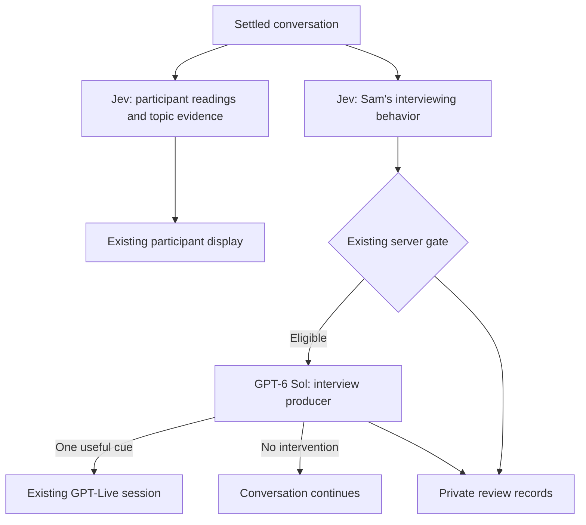

# Contextual direction for The Debrief

Status: implemented on `project-closeout-interviews` and deployed at application revision `ae9c8be` to the [existing isolated preview](https://project-closeout-interviews-out-of-character.droopy.workers.dev/interview). Main through `18827cd` is merged into this branch; the interview branch remains unmerged. Verification and deployment evidence are recorded in `interview-progress.md`.

## Recommendation

Give Sam a producer using the simulator's existing Jev → server gate → GPT-6 Sol → private voice-context path. Use only its actor lane. The participant continues to see Engagement, Openness, Specificity, and topics heard; the producer advises Sam privately. There is no participant coaching call.

The producer's purpose is to help Sam hear a good story, follow it, and know when to leave it alone. Topic coverage remains optional. A useful twenty-minute account of one delivery problem is a good interview even if most topics remain untouched.

## What main already supplies

- `core/simulator/director.ts`: per-audience admission, cooldown, issue recurrence, and bounded paid work.
- `app/server/simulator/contextual-director.ts`: generation lifecycle, one freshness recheck, private delivery acknowledgments, cancellation on End, and compact review records.
- `ai/simulator/director.server.ts`: GPT-6 Sol with reasoning `none`, strict `none`/`intervene` output, evidence validation, and the shared applicability recheck.
- Actor cue history includes submission time, settled passage at delivery, receipt status, and the review's Jev signals. The latest six completed actor assessments show what changed afterward.
- The existing voice session, transcript settlement, private archive, and synthetic rehearsal tools.

Reuse those modules. Add a small interview-specific prompt/context builder, not another director service or generalized adapter framework. Keep main's provider calls: AI SDK for Jev and the existing Responses helper for Sol. Leave summary generation on its current independent path.

## Jev questions for Sam

Replace the interview's single authored-cue selection with six independent boolean questions in its existing interviewer assessment request. Each asks whether a concrete problem is present and still uncorrected. The participant's words supply context; their personality, brevity, uncertainty, or reluctance are not defects to fix.

| Signal | What warrants review | What does not |
| --- | --- | --- |
| Missed thread | Sam ignores a revealing aside or abandons a productive firsthand story for generic topic coverage. | Sam is already following it, the participant is still explaining, or they declined the topic, stated a limit, or said they do not know. A topic marked heard is not itself a reason to intervene. |
| Question stacking | Sam asks several distinct questions or keeps pivoting before the participant can answer. | One natural follow-up, a brief acknowledgment, or an ordinary clarifying phrase. |
| Boundary pressure | Sam persists after an explicit limit, lack of knowledge, or inability to recall. | The participant states a limit and Sam accepts it. No inference of dishonesty. |
| Leading | Sam supplies a conclusion or endorses an accusation for the participant to agree with. | Neutral follow-up, accurate attributed paraphrase, or acknowledging the person's frustration. |
| Source confusion | Sam turns hearsay or a participant's interpretation into firsthand knowledge or established fact. | Sam preserves who said it and how much the participant actually knows. |
| Invented facts | Sam asserts project history, causes, outcomes, or shared experiences the participant never supplied. | Clearly tentative questions, general expertise, and grounded summaries of the participant's account. |

Define the six interview conditions separately from the simulator's `ACTOR_CONDITIONS` and include both lists in the `BooleanCondition` union. The simulator's evaluator must continue iterating only its own conditions. The gate needs no new signal kind or scheduling rules. Several signals may coexist; the existing actor gate prioritizes an eligible concern and Sol decides whether one useful action follows. A resolved concern must return false so it does not stay active forever. This also avoids forcing cue selection into the objective-choice path, whose resolution depends on objective achievement.

Keep these six interview concerns for the POC. Main's temperament, assertiveness, and style questions describe simulator clients and their stats; do not automatically transplant them to Sam. Within an eligible interview review, Sol may suggest a lighter touch or more room to listen, grounded in Sam's journalist brief. Add another trigger only if rehearsals expose a concrete missing behavior.

Start with main's actor review threshold of 0.60 and episode clearing below 0.50. These are POC tuning values, not validated interview accuracy. The old 0.90 choice probability is not a directly interchangeable threshold for independent yes/no probabilities. Keep a healthy/no-intervention set in the replay so calibration does not simply maximize cue count. [TypeSafe's Noul guidance](https://docs.typesafe.ai/primitives/noul) distinguishes these probability meanings and supports asking the independent questions together.

The existing three participant readings and fourteen topic criteria remain unchanged. Only participant passages can establish topic evidence. Do not route low participant readings or unfinished topics into coaching, concern alerts, or a demand for more disclosure.

## What the producer sees and says

Add an interview branch to `directorContext` and to instruction selection in `ai/simulator/director.server.ts`. Give Sol Sam's interviewer brief, the optional topic map, the settled dialogue with stable passage IDs and explicit `sam`/`participant` labels, the reason for review, and previously submitted interviewer notes. All project knowledge comes from the conversation. Do not give it simulator client bargaining stats, invented project facts, participant scores, heard-topic status, or a completion target. The interview's director supplies `objectives: () => []`.

Preserve the shared actor history builder when adding that branch, including `sentAt`, `afterPassageId`, `deliveryStatus`, `reviewSignals`, and `recentAssessments`. Relabel speakers without changing passage IDs. Sol should compare earlier direction with Sam's substantive replies after the cue's delivery marker and the recent interviewer assessments. A received cue is not proof of compliance; unconfirmed receipt is not refusal. Return `none` when Sam improved or has not yet had a chance to respond. Judge Sam's behavior, not whether the participant answers at length or becomes more willing to disclose. If a confirmed cue did not help after a fair opportunity, suggest a more concrete next move instead of repeating the same instruction. For boundary pressure, that means a different respectful angle, never a firmer probe. Do not escalate a missed-thread cue when the participant has moved to another useful story. Jev probabilities are fallible observations, not severity scores or proof. Participant readings never enter this private history.

Ask for one immediate interviewing move, grounded in what was actually said. Preserve the friendly journalist voice, one question at a time, uncertainty, and the participant's control over what they discuss. Direct Sam's behavior, never what the participant should say or conclude. Stated boundaries take precedence over curiosity regardless of which signal opened the review; never advise returning to a declined topic. Enforce this in generation itself, because unchanged dialogue skips the recheck. `none` is a normal successful result when Sam has already handled the moment, the participant needs room, or another nudge would repeat prior advice.

This is source checking within a conversation. It cannot independently verify allegations about the real project or decide who was at fault.

Examples of intended behavior:

| Conversation | Producer result |
| --- | --- |
| The participant mentions three weeks lost to access; Sam skips to a generic tools question. | “Stay with the access delay; ask what it prevented them from doing.” |
| The participant declines to identify someone; Sam asks for the name again. | “Accept the limit; ask about the handoff process without naming anyone.” |
| Sam asserts that a sponsor deliberately blocked the team without supporting evidence. | “Ask what they observed; avoid assigning motives to the project sponsor.” |
| Sam is already exploring the access delay with a useful follow-up. | `none` |

Reuse the 8–16 word target, 160-character cap, and 1–3 real evidence IDs. Evidence for a producer correction may cite either speaker; that is separate from participant-only topic credit.

Strengthen Sam's startup brief to explain the same producer convention as the simulator: interpret a relevant cue at the next natural opportunity, never announce or read it aloud, and treat it as direction rather than a new project fact or allegation to repeat. Current dialogue and the participant's stated limits always take precedence over a cue.

## Shared timing and integration

- Instantiate the existing contextual director for interviews and observe only the actor lane. `grade()` must not start a trainee observation before taking its interview branch; otherwise it would create orphaned pending reviews or participant coaching.
- Keep the current settled-dialogue cadence. Continue using a separate interviewer Jev request alongside participant assessment, with the existing timeouts.
- Use main's limits unchanged initially: one actor generation in flight, 20-second start cooldown, reconsideration after 60 seconds plus new dialogue, 20 actor generation calls and six submitted notes per session. This replaces the legacy 90-second same-cue rule rather than stacking two cooldown systems.
- Keep up to 15 seconds for generation within the 20-second total window, and the single applicability recheck when settled dialogue changes. Select interview-specific instructions in `recheckDirector`, reusing Sam's context. Discard resolved, stale, or boundary-violating advice. Replace the simulator's blanket “topic moved on” rejection for interviews: returning to an overlooked detail can help, unless the participant has declined it or a more useful thread is underway.
- Preserve main's JSON serialization of recheck state. Optional context fields must not reintroduce the SDK validation failure fixed in `a49e9f8`.
- Continue delivery through `session.thinking.append` in the existing session. End cancels outstanding producer work; the summary still begins after voice closure.
- Remove the legacy fixed-cue sender, selector payload, repeat tracking, and interview-only director flag when the new path is connected. Do not run both senders or retain a fallback.

An acknowledgment proves context delivery, not that Sam followed it. Judge the subsequent conversation, including whether a cue was repeated aloud. The update cannot revise speech already generated. This follows the [GPT-Live runtime-context behavior](https://developers.openai.com/api/docs/guides/live-conversations#understand-when-context-reaches-the-model).

## Private archive and Workshop

Add one additive migration, `0003_interview_interventions.sql`, for `interview_attempts.interventions_json`, following the simulator column (`TEXT NOT NULL DEFAULT '[]'`). Store the existing compact observation/generation records and director provenance there. Keep older `cues_json` rows readable; new attempts write `'[]'` to that required column and use the new records. No extra counters, repeated transcript-ID arrays, table family, queue, or review UI.

Preserve the interview archive's pending-to-ready summary protection and separate table. Producer notes remain out of public snapshots, summaries, browser bundles, and routine simulator exports. Summary input stays the actual conversation. Saves remain best effort.

Refresh the existing interview analysis Workshop story with synthetic Jev signals, generated direction or `none`, and the relevant excerpt. Reuse the existing fixtures/replay tools; add no new main screen. Real project material stays in private storage.

## Small implementation sequence

1. Add the six Jev signals and Sam-specific Sol context/instructions. Reuse the shared generator and recheck, and bump the interview rubric version. Cover current problems, corrected problems, and healthy conversations with the existing synthetic fixture style.
2. Connect only the actor lane, remove the authored sender, and add the private archive column. Preserve participant evidence, public readings, End behavior, and summary handling. Update the rehearsal script to use the same path.
3. Refresh Workshop recordings and run a few bounded provider rehearsals. Review the integrated change for simplicity, then use the isolated branch preview for real conversation testing when deployment is requested.

Update the existing consumers together: interview fixtures, `ai/interview/run.ts`, recordings, and `app/storybook/interview-judging-story.tsx`; session and archive tests; `scripts/simulator-roleplay-probe.mjs`; and the privacy bundle check. Replace the bundle check's old cue strings with private producer/recheck instruction samples. Remove `canSendCue`, `SentCue`, the cue imports, and the director flag from both Wrangler configurations, its environment type, and acceptance instructions. Keep old recorded choices clearly historical until replacement recordings are ready.

At the next authorized preview deployment, apply main's `0002_simulator_interventions.sql` as well as the new interview migration. The existing preview predates both. Keep the summary upsert guard unchanged.

Useful checks: terse precise answers; a productive long single-topic story; leading question plus vague assent; a boundary accepted versus pressed; named secondhand criticism; invented project facts; an ignored aside; several questions at once; and a concern corrected while Sol is working. Check that the recheck permits a useful return after Sam skips a detail but rejects that same advice after the participant declines the topic. Exercise `none`, invalid evidence, timeout, End during generation, private archive round-trip, and simulator regressions through the existing tests.

Retain the cue-history checks from main and exercise them with Sam's context: no second nudge before a substantive response, no repeat after improvement even if the participant stays terse, a more concrete cue after continued drift that respects boundaries and productive new threads, and actor-only assessments that never include participant scores. The submission marker must reflect delivery time even if new dialogue arrived during generation.

Run `bun run check`. A few real synthetic conversations should establish whether Sam uses cues naturally and keeps quiet when direction is unnecessary. Do not add a statistical release program for this POC. A live acknowledgment alone is insufficient behavioral evidence.
