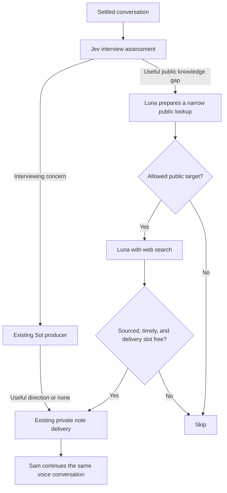

# Interview story value and timely research

Status: implemented and reviewed; local verification complete. Based on `project-closeout-interviews` at `35d6e2a` (includes main through `3819e6a`). Companion context: [streaming plan](interview-streaming-plan.md), [progress and verification](interview-progress.md), and [existing director design](interview-contextual-director-plan.md).

Concrete payload draft: [Jev state, questions, criteria, and routing](interview-jev-request-design.md).

## Outcome

Sam should discover what mattered to someone who worked on the project. A short orientation should lead into useful experiences, rather than an inventory of requirements, architecture, and delivery phases. Sam should also be able to benefit from an occasional public-information lookup while the conversation continues.

Keep two independently testable changes: better editorial judgment, then optional research. Reuse Jev, the Sol producer, and the existing GPT-Live session. This remains a POC, with no new agent platform or persistent research service.

## Research basis

[Harcup and O’Neill’s news-values research](https://eprints.whiterose.ac.uk/id/eprint/95423/11/WRRO_95423.pdf) identifies conflict, surprise, relevance, magnitude, good news, and human interest among factors in published news. It describes editorial selection, rather than prescribing a universal scoring formula. Those ideas suggest looking for consequential experiences and telling details in interviews; popularity and celebrity are not useful targets here.

[Solutions Journalism Network’s four pillars](https://www.solutionsjournalism.org/learning-lab/toolkits-guides/curriculum-builder/essentials-teaching-solutions-journalism/4-pillars) add a useful balance: understand a response, its evidence, transferable insight, and limitations. This helps us recognize effective work and quiet prevention, as well as conflict. These are prompts for curiosity, not four mandatory questions for every story.

The following adaptation is our product judgment, not a validated workplace-interview instrument.

## 1. Give Sam a shared definition of a useful story

Use five overlapping angles to clarify editorial judgment, not five scores or a checklist. Sam's current brief already covers much of this; add the colleague test below rather than another long briefing or shared-prompt abstraction.

| Angle | What Sam listens for |
| --- | --- |
| Stakes and impact | What changed for people, delivery, or the client; what a decision cost or prevented. |
| Tension and choices | Competing priorities, constraints, disagreement, or an uncomfortable tradeoff. A fight is unnecessary. |
| Surprise and contrast | Something worked differently from what people expected, including an unexpectedly good result. |
| People and contribution | Someone made a difference; trust changed; an experience felt meaningful. Preserve shared credit rather than impose a hero or villain. |
| Useful learning | A concrete experience another team could learn from, including an ordinary practice that quietly worked well. |

The test is: **Would a colleague who was not there learn something meaningful or useful—and is there a useful unanswered question left?** A valuable story may already be complete. A routine opening may conceal something worth exploring.

Keep the agreed opening: “What were you building on this project?” Then orient only as needed. Follow an offered story before asking generic background. If the introduction is only factual, invite what stood out about working on it. Do not force a dramatic event, lesson, personal disclosure, or negative story. Technical detail belongs when it explains the experience. A clear brief answer can be enough.

Synthetic example:

- “We gathered requirements.” Enough background; do not automatically ask for each workshop and artifact.
- “We held six workshops, but the warehouse supervisor was never invited.” A promising lead. “What difference did their absence make?” is a grounded next question.
- “Nia mapped the approval owners before kickoff, so access was ready on day one.” A quiet success. Understand what made that effective if unclear; do not hunt for hidden conflict.

## 2. Let Jev detect interviewing choices that need help

Keep the existing six interviewer checks, sharpen `missed-thread`, and add just one check:

| Check | Draft question and exclusions |
| --- | --- |
| `missed-thread` (existing) | Is Sam overlooking or abandoning a participant-supplied story with meaningful stakes, a choice, surprise, contribution, or useful learning, while a useful follow-up remains? False if Sam is following it, the participant is still explaining, another useful story is underway, or the participant declined or cannot answer. |
| `overprobing` (new) | Is Sam prolonging a line of questioning without adding useful understanding, by collecting routine inventory after enough orientation or repeatedly probing an adequately explained point? Require observable Sam-driven probing. False for the opener, necessary clarification, useful technical depth, or detail the participant is voluntarily developing. Brevity, a pause, or an undramatic answer is insufficient. |

These are judgments about Sam’s current conversational choices, not a boredom score for the participant. [Jev/Noul returns the probability that a proposition is true](https://docs.typesafe.ai/primitives/noul); it does not return the degree of “interestingness.” Keep questions independent and bound them to the available recent transcript.

The existing server gate still controls freshness, cooldown, work in progress, and budgets. A qualifying check requests Sol’s opinion; Sol can return `none`. A cue might encourage staying with an overlooked decision, leaving a repetitive recap, or letting a complete answer stand. Those are prompt directions, not a new runtime action enum. Good interviewing should normally produce no intervention.

Make priority explicit for interviews: boundary pressure first, then source/leading/fabrication concerns, question stacking, and finally story-flow concerns. Today the actor lane orders only by probability, so a confident recap signal could delay a boundary correction. Use a small interview-specific ordering; preserve simulator behavior. Keep the participant readings, fourteen optional topics, participant-only credit, summary model, and transport unchanged.

## 3. Add a separate, bounded research path

Research should earn its place by improving a question about the participant’s experience. An early overview of the actual client’s business is a useful case for the existing research judgment; an incidental vendor or product name alone is not. Sam asks who the client was early if the participant has not already identified them, one question at a time, without interrupting a developing story or pressing a declined identity. This is a prompt change within the same research path, not a separate trigger, call, or state machine.

**Would a quick public-information lookup help Sam understand the participant’s account or frame a useful later question?** A clearly identified project client whose business context is missing is sufficient: learn what it does, whom it serves, and how it operates. Sam can use that context later without interrupting the current story. False for an incidental name-drop, already supplied context, trivia, ambiguous identity, a declined subject, or an answer best obtained from the participant. Private project events, motives, personal information, and allegations are not research targets.

This requests a research attempt, not a mandatory search. Luna's preparation can decline. Jev is not a guarantee of query privacy or source truth.

Use **GPT-6 Luna** for research and keep Sol responsible for interview direction. [The Luna model documentation](https://developers.openai.com/api/docs/models/gpt-6-luna) lists Responses web search support. The installed AI SDK (`ai` 7.0.118, `@ai-sdk/openai` 4.0.78) already supports `openai.tools.webSearch`, provider tool-call limits, and returned sources. Verify the exact model/tool combination with a bounded synthetic smoke before wiring it into live sessions; documentation is not account-level runtime evidence.

### Small execution contract

- Add a plain setup disclosure: “Sam may look up public background on organizations, products, and terms you mention.” This explicitly covers the requested client lookup; private project details remain outside searches.
- Prepare in a tool-free Luna call from the relevant exchange and the existing completed-target keys (`alreadyResearched`). Do not select a completed target; this lets a later technical gap get its own lookup after the client overview. Return no lookup or `{ kind: organization | product | term, name, passageId }`. The server checks that the name is a short verbatim span of participant speech (at most six words), not Sam's suggestion. Preparation rejects people, internal project names, budgets, quotes, complaints, and ambiguous entities. Publicness still requires model judgment; uncertain cases skip rather than guess.
- The web-enabled Luna call receives **only `{ kind, name }` plus fixed instructions**. No transcript, project rationale, private question, or passage text crosses into that call. This is why two small calls are justified. Prefer official or authoritative sources. Use `store: false`, low reasoning, at most two built-in tool calls, three attempts per interview, one outstanding lookup, and a 25-second total deadline. These are starting POC limits to verify, not latency promises. No retry, crawl, vector database, or cross-session cache.
- Return at most two short facts with actual provider source URLs, or no useful result. Verify identity and keep the source/retrieval date. Label this current public background; it does not establish historical project conditions. Web pages are untrusted data, never instructions. Skip uncited or ambiguous results.
- Deliver only while the session is live, before the deadline, with no Sol cue in flight or sent in the preceding 20 seconds. Share `gate.sendNote` and its six-note cap, with at most two research notes. Drop a blocked result; no queue or post-search Sol/Jev call. A clearly labeled public-background note reaches the existing `session.thinking.append` transport. Sam can use it for a neutral question now or later when relevant, without pivoting to it or interrupting a developing story. Verify that this lighter freshness rule does not cause delayed topic pivots before keeping it.
- Sam keeps talking and listening. Use the background to ask a better neutral question; do not lecture, diagnose, claim prior familiarity, or challenge the participant with a website. The participant's account remains their account even when public material differs.
- On delivery, show a compact “Background Sam received” reference with the short fact and clickable source. This avoids a new detector for whether Sam used it aloud. Keep query rationale and producer directions private. [OpenAI’s web-search guidance](https://developers.openai.com/api/docs/guides/tools-web-search#output-and-citations) requires visible clickable citations when presenting web-derived information.

Illustrative behavior: a participant describes connecting field operations at a named company. A lookup might clarify the company’s public operating model and help Sam understand a later remark about dispersed sites. It must not turn that background into an assertion that this project had coordination problems. “How did that work for your team?” remains a question; the answer belongs to the participant.

### Keep public background separate from project evidence

The current brief says Sam knows only what the participant tells it. Amend that specifically: Sam may also receive labeled, sourced public background, which does not establish project events. Supply only delivered facts/sources to the interviewer’s source/fabrication checks and producer context. Avoid a blanket exemption for anything Sam calls “public background.” Do not supply research to participant grading or the summary generator. Add a short summary instruction excluding outside background Sam mentions; the participant's bare agreement still cannot establish a topic.

Save target, sources, result, timing, skip reason, and delivery status in the existing private interview archive JSON with an explicit research record type. Keep ordinary simulator exports unchanged. Add two synthetic Debugger cases for delivered background and skipped research, reusing the current viewer. This needs a small record/type addition and source-link presentation, not a new database or screen.

## Implementation checkpoints, after plan approval

The implementation goal is to complete the story judgments and bounded public research path, verify their privacy and lifecycle boundaries with tests and measured provider rehearsals, inspect the isolated UI, obtain Claude desktop code review, and commit the result. Deployment and merging are separate actions.

Final desktop alignment corrections: a research attempt means one preparation call; the research signal must fall below 0.5 before a new episode can attempt preparation. The 25-second deadline starts at the observation's captured time. Normalize case, punctuation and whitespace when verifying the participant's six-word target span. Add background and the omission flag only to the interviewer request, never the shared participant state helper.

1. **Story judgment.** Add the colleague test to the existing brief; sharpen `missed-thread`, add `overprobing`, and align Sol's instructions. Add interview priority ordering, update the rubric version, and refresh relevant fixtures/Debugger recordings. Measure before tuning thresholds.
2. **Research helper and delivery.** Add one research judgment and a focused interview research module with typed preparation/result boundaries. Let the existing `ContextualDirector` own its abort/lifetime and shared delivery gate. Make the source/brief/archive/UI changes together. Run the Luna smoke before integrating research; retain live research only if rehearsals show better questions without distraction. Avoid an agent framework.
3. **Behavior verification and cleanup.** Review the exact diff at each checkpoint, run the repository gate, and exercise the actual voice path. Deployment is a separate requested action.

## Verification that would change our confidence

Use authored transcripts with observable expected behavior, not assertions about exact prompt text:

- Routine opening allowed; sustained inventory after orientation flagged.
- An overlooked conflict, surprise, or quiet win flagged; productive technical depth allowed.
- Repeated probing after a complete answer flagged; a terse answer alone allowed.
- Explicit boundaries, honest uncertainty, hearsay, leading questions, and corrected behavior retain their existing protections.
- Interviewer Jev still fits the current 2.5-second timeout with the added questions; a slower optional feature must not suppress boundary checks. Measure before changing cadence or timeout.
- Boundary/source correction wins over a higher-probability story signal; simulator priority is unchanged.
- Research helps an actual public knowledge gap or supplies an early client business overview; an incidental vendor mention alone does not trigger it. Reject a target absent from participant speech, and inspect exactly what reaches the web-enabled call.
- Ambiguous companies, private complaints, and unsupported results produce no factual note. Web instructions are ignored, and current background is not presented as a fact about an earlier project.
- Private clauses stay out of queries; research never interrupts speech, delivers after End, exceeds two delivered notes, collides with a corrective cue, completes participant topics, or becomes independent project evidence in the summary. Confirm that delivered source links are visible on mobile as well as desktop.

Run bounded real Jev fixtures and Sol replays to test false positives before changing shared thresholds. Run a small Luna web-search smoke with public synthetic data and inspect the actual queries and cited results. Refresh Debugger recordings only with synthetic material. Finish with short real GPT-Live rehearsals for a quiet success, a difficult decision, and an optional research opportunity; compare cues with Sam’s subsequent turns. Then run `bun run check` and the relevant existing browser acceptance scripts.

## Claude desktop review and disposition — September 27, 2026

Opus reviewed the draft against current code in the existing desktop review session. Story slice: no blockers, with simplifications and a priority fix. Research slice: resolve organization-lookup disclosure and citation delivery before implementation. Both are now specified above.

Accepted: one added story detector, one research trigger, no shared-guide refactor, explicit interview priorities, two-call public-input isolation, immediate source references, bounded research with no post-search model call, shared lifetime/delivery, and latency checks. Research stays a separate checkpoint because its benefit is less certain than fixing the recap.

Kept with judgment: a small context of actually delivered public facts for source checks, rather than trusting any attributed public claim; source dates without a new date-validation service; two synthetic Debugger cases to honor the established isolated-testing workflow. Deferred model-threshold changes until fixtures justify them. No application changes, provider experiments, or deployment were performed for this planning review.
