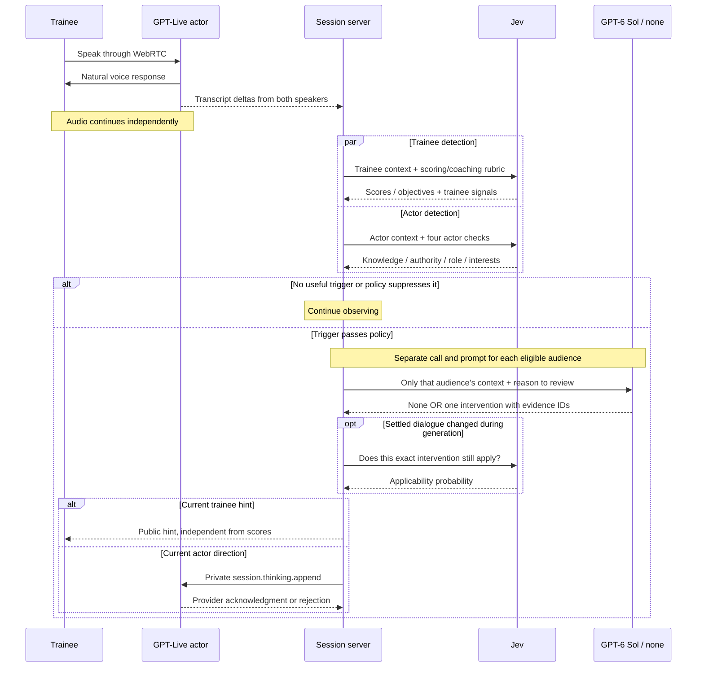

# Contextual live coaching and actor direction

Status: implemented locally on 2026-09-27. No deployment has occurred. Andrew's latest requirement makes this the only coaching path for scored scenarios: no director feature flag, modes, or legacy delivery fallback.

## Decision

Jev recognizes moments that deserve attention. GPT-6 Sol with `reasoning.effort: "none"` writes one specific trainee hint or private client direction. The server starts this work from settled transcript observations while the voice conversation continues. The voice actor does not call a tool. Jev continues to assign scores, objective judgments, and evidence; Sol cannot change grades.

This replaces authored live hint/cue delivery. Objective hint examples remain inputs to Jev's choice rubric; they are not delivered to the trainee. Authored actor cues, their selector, and the old cue policy have been removed. Stored historical attempts and checked-in recordings remain evidence of prior behavior.

OpenAI's model documentation confirms `none` and structured-output support. The implementation uses a direct Responses request, the existing server credential, strict JSON, and Zod validation. It does not add tools, retries, or a heavier-model fallback.

## Sequence

## Boundaries and detection

The trainee director receives the public scenario catalog fields, client name/role, public objective progress, observed dialogue, and that audience's delivered generated hints. It receives no private client facts, behavior, constraints, grading criteria, actor notes, or hidden answers.

The actor director receives the actor evaluator's client role, facts, interests, behavior, world limits, observed dialogue, and prior submitted actor directions. It receives no consultant lead/briefing, services, objectives, scoring, trainee hints, or serious-mistake rubric. World limits constrain behavior without automatically becoming knowledge the client can assert.

Only published/submitted generated advice enters repetition history. Discarded drafts and rejected notes were not useful interventions; generic immediate concerns are placeholders for a specific replacement. Raw prompts and private intervention history never enter public snapshots or client bundles.

Trainee triggers reuse Jev's existing material-mistake probability and objective choice, plus a new repeated-unproductive-approach condition. Actor triggers are four independent probabilities in one actor-only Jev request: `knowledge` checks unsupported material facts, `authority` checks commitments outside the client’s remit, `role` checks taking over the consultant’s work or narrating the simulation, and `interests` checks contradictions with the client’s goals and priorities. The first three give concrete reasons for being out of character; no aggregate probability is invented. Real client expertise and earned cooperation remain appropriate. Trainee and actor detection use separate Jev requests; each director invocation uses only that audience's instructions, context, and history. Invalid optional signals are omitted without losing valid scores. The rubric version is `simulator-rubric-v10`; director rules/prompts are `contextual-director-v1`.

The model returns only `{ action: 'none' | 'intervene', text: string | null, evidenceIds: string[] }`. An intervention needs nonempty text of at most 400 characters and 1–3 distinct real dialogue IDs; `none` needs null text and no evidence. Refusal, incomplete response, invalid shape, or fabricated IDs cannot become advice. No partial streaming output is shown.

## Scheduling and lifecycle

- Reuse the current Jev observer cadence: new settled dialogue only, trainee assessments at least five seconds apart; actor assessment within eligible grading rounds at least eight seconds apart. Open conversations without objectives have no judging or director work.
- Each audience has one generation request in flight and a 20-second start cooldown. A synchronous shared counter limits a session to 60 generation calls, including `none`, failures, and stale results. Actor notes stop at six submitted directions, including subsequently rejected/unacknowledged notes.
- Prioritize a material concern over other trainee coaching throughout its hysteresis band. Activation is 0.85 for trainee mistakes, 0.80 for trainee stagnation, and 0.60 for the four actor signals; clear below 0.50. The actor threshold requests Sol’s second opinion rather than asserting that a direction must be sent. An active issue may be reconsidered only after 60 seconds and two new passages from the relevant speaker, with a new revision.
- Objective coaching uses one identity per objective for the session. Choice noise (`none` or A→B→A) does not reset dismissal or the last review. Objective selection is categorical and has its own typed signal, not a synthetic probability. A published objective hint remains until achievement, expiry, replacement, or end. Pending work survives choice noise, but still requires whole-dialogue applicability and an unachieved objective. A cleared boolean can create a new episode.
- Capture time `t0` precedes Jev. The entire generation/recheck path expires at `t0 + 20s`; generation gets `min(now + 15s, t0 + 17s)`. One three-second recheck is allowed only if at least three seconds remain, with a shared maximum of 60 rechecks.
- Gate results must still match the whole settled dialogue before starting generation or showing an immediate concern. New speech from either party can correct the issue. If dialogue changes during generation, Jev must give at least 0.90 applicability to the exact output. Another change during recheck discards it. Partial audio does not invalidate settled context.
- Director requests run independently of grading and have their own abort controller. Ending aborts requests, clears the public hint, and marks pending records aborted without waiting on Sol. Late completions cannot alter the archived result.

The server owns hint expiry (30 seconds). The browser can hide a hint after the supplied lifetime measured from receipt, without trusting the device's wall clock; polls clear it at the authoritative expiry. Generated replacements retain the immediate concern's ID, so dismissing the generic message also dismisses the specific replacement. Score updates do not change hint identity.

Actor direction uses `session.thinking.append`, `delegation_id: null`, and `cue-` event IDs over the server WebSocket attached to the existing GPT-Live session. Browser audio continues on WebRTC. The initial actor instructions say to use private notes naturally without reading them aloud. Runtime notes add quiet context over time: they do not interrupt speech or rewrite audio already generated. An acknowledgment establishes context delivery, not actor compliance or playback timing. Socket submission, provider accepted/rejected/unknown, and subsequent actor behavior are distinct evidence. Optional cue errors remain private and cannot become a trainee-visible voice failure.

## Archive and implementation

`core/simulator/director.ts` owns gate policy, private budgets, and contracts. Its review callback owns slot release, and its recheck/submission callbacks enforce their own caps. `ai/simulator/director.server.ts` owns context projection, Responses validation, and Jev applicability checks. `app/server/simulator/contextual-director.ts` owns request lifecycle, the current hint, and private intervention records. The session supplies scenario/client IDs, objective progress, settled dialogue, and its canonical freshness predicate; it projects the current hint in one place, launches work, forwards provider acknowledgments, and closes the director. The director never owns or mutates the session snapshot.

Migration `0002_simulator_interventions.sql` adds `interventions_json`. Records distinguish fixed detector alerts from generated director work. They include audience, typed signal, input revision/IDs, snapshot/gate/ready/publication-or-send times, model, validated result, and outcome. Director records additionally hold effort, usage, and any recheck or actor delivery. Only actor delivery gets a provider event ID. A complete director summary is captured before archive awaits; unscored sessions record null. `deliveredAt` means publication into public state or socket submission; it is not proof of browser display or actor compliance. Historical `cues_json` remains stored; new sessions use only interventions. The export command requires the migrated schema.

Apply migration 0002 before deploying this Worker. Verify a real archive write/read after any deployment; a health check cannot detect a swallowed archive-write error. The additive schema preserves existing attempts.

## Verification and release evidence

The current implementation passed `bun run check`: 202 tests, 6,364 assertions, typecheck, production build, client-bundle privacy checks, and Wrangler deployment dry run. The tree remained byte-for-byte stable throughout the run; source fingerprint `e98eb5f416606ae4c709a54f1fed1e0542657a782b283948b6c1f7bc0e48bd1b`. Only this review record was updated afterward. Reports are under `output/contextual-director-reviewed/`. The unchanged UI previously passed 24 browser cases across the feedback, compact, and full Workshop suites, with zero API, microphone, or page errors; the judging-page smoke also passed. Browser reports are under `output/contextual-director-reviewed-browser/`.

The decomposed actor checks passed ten synthetic Jev cases: unsupported knowledge, unauthorized approval, consultant takeover, simulation narration, and interests drift were eligible; normal discovery, real client expertise, and substantive corrections stayed quiet. A combined out-of-character question missed several cases; separate questions retain the reason for escalation. The actor referral threshold is 0.60 because this is a second-opinion request, with Sol free to decline. These same cases informed the rubric and threshold, so this is development calibration, not held-out validation. Reports are under `output/contextual-director-refinement/`.

Two end-to-end provider replays produced separate trainee and actor Responses calls. Actor directions corrected simulation narration in 2.16 seconds and an unearned ownership concession in 2.29 seconds. Trainee calls returned `none` for an already-appropriate question and a targeted hint for the inappropriate ownership proposal. Those Sol calls took 2.75 and 3.87 seconds respectively. These replays verify generated content, not voice-actor compliance.

Real wall-clock tests with local provider stubs measured generation cancellation at 15,006 ms and recheck cancellation at 3,003 ms; neither published a hint or submitted an actor note. Behavioral tests cover a useful response after twelve seconds, newer speech resolving the issue, expiry at twenty seconds, and cancellation on End.

Four synthetic provider replays produced eight gate windows, three escalations, and six generation calls comparing Sol `none` and `low`. Earned discovery and repaired authority produced no generation calls. Overpromising triggered both audiences. The repeated demo-takeover fixture initially missed the actor gate (ownership probability 0.65, later 0.72). Its same-response hand-back phrase conflicted with a detailed client-authored scope and estimate. The role rubric retains that distinction from a later substantive correction.

The initial `none` calls took about 2.3–3.8 seconds. `low` was faster in two of three paired comparisons. This establishes working API integration, not a model speed ranking. Those runs preceded the final removal of the authored actor-cue question.

Before the decomposed actor checks, the ownership rubric was checked against three synthetic actor cases: repeated takeover escalated at 0.82; a later substantive refusal stayed below threshold at 0.44; ordinary discovery stayed below threshold at 0.09. A prior paired replay with the structural changes returned specific trainee hints in 2.3–3.3 seconds; its actor takeover escalation returned `none`, demonstrating that a gate is a review request rather than a forced direction. These are development checks, not an independent held-out quality estimate.

`bun run eval:director --paid --fixture=<id> [--compare] [--every-turn]` is a bounded development replay. It records positive and negative gates, uses fixed synthetic transcripts, supplies no intervention history, and has relaxed provider timeouts for inspecting quality. It does not establish live timing, rechecks, actual UI delivery, or actor compliance. The paid roleplay probe uses the production director controller for private actor direction.

Before release, evaluate held-out usefulness, recall, latency, interruption rate, cost, and subsequent actor compliance. Proposed goals remain: no leaked private answers or invented facts in generated directions; at least 20 independent cases per critical condition; at least 90% usefulness across 50 delivered interventions; no intervention in at least 90% of 30 independent healthy 30-second windows; p95 gate-return-to-ready latency at most five seconds. Count timeouts, stale discards, and budget/cooldown misses separately rather than hiding them from the success denominator. These release thresholds have not been established by the smoke sample.

## Review record

Claude Opus 5.5 reviewed the original plan twice through the desktop UI. Scheduling, deadline accounting, objective identity, context allowlists, private archival history, note caps, and cancellation were revised. Andrew subsequently removed modes and legacy compatibility from the requirement; the implementation and this document follow that decision.

The first implementation review found no privacy or abort blockers. Accepted corrections: block ordinary calls throughout a latched concern, preserve published objective hints across choice noise, omit invalid optional signals, bump the rubric version, use clock-independent browser lifetimes, and remove legacy cue validation. Added regression coverage for these behaviors and repeated actor submissions. Self-review also excluded undelivered drafts and fixed placeholders from repetition history.

One suggestion was not adopted: applying obsolete mistake judgments before the freshness check can show a concern after newer speech already corrected it. The implementation retains whole-dialogue freshness, tests that counterexample, and records stale gates so detection delay/starvation can be measured. Publication time is explicitly distinguished from browser display time.

The two additional independent thermo-nuclear reviews were run after the initial reviews, using fresh contexts and the requested skill:

- Astra found residual public hint fields, unused mandatory actor scores, and paid actor detection after the note cap. All were removed or corrected. Its structural follow-up cleared budget ownership, hint ownership, categorical signals, validated outputs, archive provenance, and the previous findings. It independently passed 48 targeted tests. Its final rubric consistency correction was also applied and provider-tested.
- A fresh Claude Opus 5.5 session found caller-owned gate invariants, shared session/hint ownership, fabricated objective probabilities, loose output/archive contracts, and obsolete diagnostics presentation. The fixes above address those findings. Its focused follow-up confirmed all six fixes and found no remaining high-confidence correctness or structural blocker. It also reviewed the final telemetry correction and cleanup and found no blocker.

After Andrew authorized the decomposed actor checks and longer deadline, Astra independently reviewed the final refinement and reran 47 focused tests: all passed, with no blocking finding. The ten calibrated Jev cases do not establish held-out quality.

The objective-probability suggestion was adapted rather than copied: a categorical choice among several objectives is not a boolean probability, so the implementation gives it an explicit selection contract. Both a changed choice and a newly achieved objective have regression coverage. Historical raw recordings remain inspectable, but their obsolete actor-score/cue interpretation panel is removed and new eval output goes to `output/`.

Follow-up dispositions:

- Browser dismissal remains local. A still-unachieved objective can be reconsidered after 60 seconds and two new passages even though its stable ID remains hidden in that browser. This accepted limitation can consume the shared call budget and trainee cooldown; publication is not proof of display. Synchronizing dismissal with the server is a future protocol change, not part of this implementation. Use intervention IDs/outcomes and budget counters when investigating it.
- Failed, aborted, or timed-out rechecks leave unknown probability/duration as null; completed rechecks retain measured duration. Post-end acknowledgments are intentionally ignored to keep archived terminal state immutable, so last-moment actor submissions can remain unknown.
- The session retains actor detection scheduling alongside the existing settled-dialogue grading cadence. Moving this small scheduler into the director was optional; it would split scheduling ownership without changing behavior. The redundant closing condition was removed.
- The stale Workshop description, orphaned styles, legacy test assertions, and pending-review plan text were corrected. The entire existing Workshop suite passed afterward.
- Live p95 latency, stale rates, concern starvation, actual actor compliance, and real D1 archive writes remain release verification work. Unit tests and synthetic provider replays do not establish those results.

No feature flag, shadow mode, compatibility delivery path, heavier-model fallback, deployment, or release migration was added or performed.

## References

- [GPT-6 Sol model](https://developers.openai.com/api/docs/models/gpt-6-sol)
- [GPT-Live runtime context delivery](https://developers.openai.com/api/docs/guides/live-conversations#understand-when-context-reaches-the-model)
- [GPT-Live sideband commands](https://developers.openai.com/api/docs/guides/voice-server-controls#observe-events-and-send-commands)
- [TypeSafe Noul probability judgments](https://docs.typesafe.ai/primitives/noul)
- [TypeSafe conditional escalation pattern](https://docs.typesafe.ai/cookbooks/sde_cascade)
