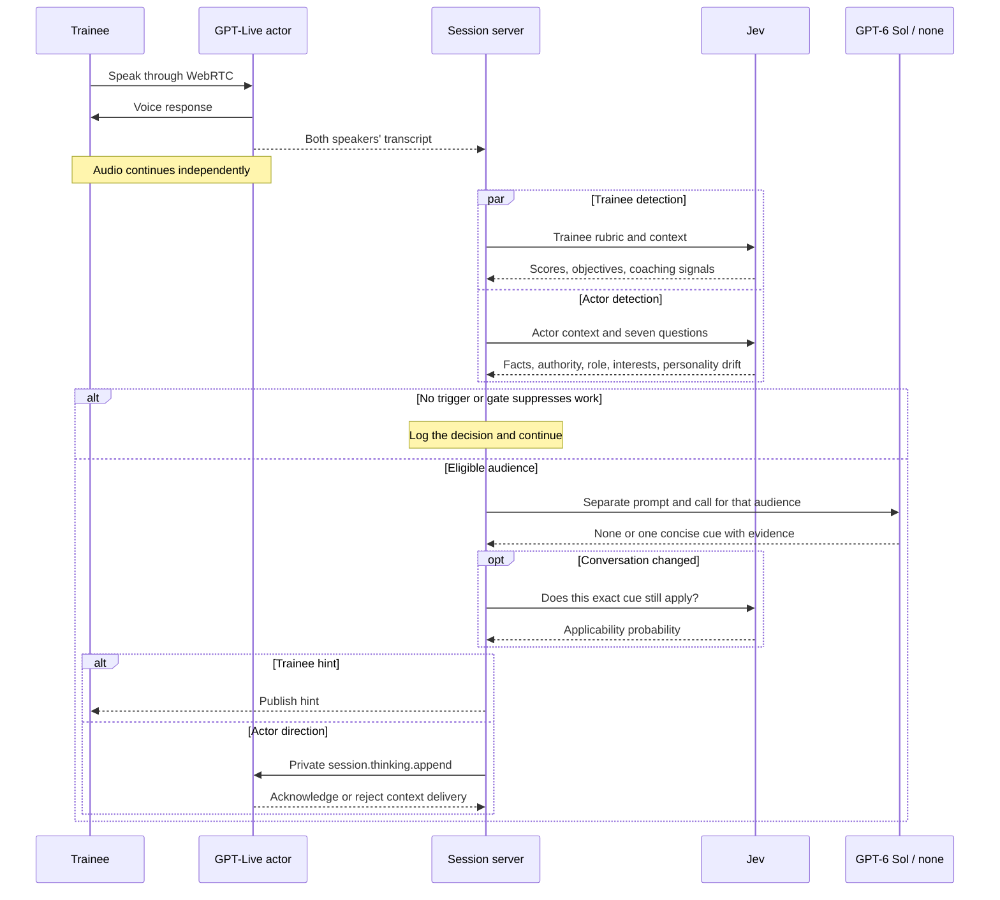

# Contextual live coaching and actor direction

Implemented for the demo. This is the only live coaching path for scored scenarios: no feature flag, shadow mode, or legacy delivery fallback.

## Flow

Jev identifies moments worth reviewing. GPT-6 Sol with `reasoning.effort: "none"` writes one short trainee hint or private client direction. The voice actor is `gpt-live-1`; it does not call a tool to request direction. Jev (`jev-1.13.0`) continues to assign scores and objective judgments. Sol cannot change grades.

## Separate audiences

The trainee director receives public scenario information, client name/role, objective progress, observed dialogue, and previously published trainee hints. It receives no private client facts, interests, grading criteria, or actor directions.

The actor director receives the client's role, personality, facts, interests, world limits, observed dialogue, and previously submitted actor cues. Each cue includes its submission time, the last settled passage when sent, provider receipt status, and the Jev signals that prompted its review. The six latest completed assessments for the same audience supply recent probability trends, including the current assessment. Sol compares subsequent dialogue with the earlier direction: improvement or no opportunity to respond warrants silence; a confirmed cue that did not help may warrant a more concrete instruction. Receipt is not compliance, and Jev probabilities are advisory evidence. It receives no trainee objectives, scores, briefing, or hints. World limits constrain behavior without becoming facts the client can claim to know. Discarded drafts and rejected cues do not enter repetition history.

The actor has seven independent Jev probabilities in one actor-only request:

| Question | Concrete concern |
| --- | --- |
| Knowledge | Asserting material facts the character would not know |
| Authority | Making commitments outside the character's remit |
| Role | Doing the consultant's work or narrating the simulation |
| Interests | Contradicting the character's goals and priorities |
| Temperament | Unearned confidence, reassurance, warmth, or openness inconsistent with the assigned character |
| Assertiveness | Challenging or yielding in a way that contradicts the character's specified approach |
| Style | Losing the assigned manner of conversation, such as thoughtful brevity or expansive initiative |

Personality questions assess wording and interaction choices in recent substantive responses. They do not infer loudness, pitch, or other acoustic performance from text, and ordinary courtesy and earned adjustments remain appropriate. These three questions share the existing actor request and 0.60 referral threshold; no extra polling or separate personality service is added.

Real expertise and earned cooperation remain appropriate. The strongest eligible actor signal is reviewed first. Trainee and actor use separate Jev requests and separate Sol instructions, contexts, histories, and Responses calls. Authored objective hint examples remain only as Jev classification inputs; delivered hints are generated from the conversation. Authored actor cues and their old selector are removed.

## Gate and timing

The server gate is ordinary code deciding whether an observation should spend a Sol call:

- Only new settled dialogue triggers assessments. Trainee rounds are at least five seconds apart; actor rounds run within eligible grading rounds at least eight seconds apart. Open conversations without objectives have no judging/director work.
- Trigger thresholds: trainee material mistake 0.85, repeated unproductive approach 0.80, actor concerns 0.60. These are initial demo tuning values. Actor eligibility requests a second opinion; Sol may return `none`. Boolean episodes clear below 0.50. Objective selection is categorical, not an invented probability.
- Each audience has one request in flight and a 20-second start cooldown. A persistent issue can be reviewed again after 60 seconds and a new transcript revision. Objective identities remain stable across choice noise; a material concern takes priority over other trainee coaching.
- Generation budgets reserve 40 calls for trainee coaching and 20 for actor direction, counting declines and failures. Actor direction stops after six submitted cues. The allowances are caps, not targets.
- Sol gets up to 15 seconds, within a 20-second total age limit measured before Jev starts. Three seconds are reserved for one Jev applicability recheck if the dialogue changed. Publication requires at least 0.90 applicability and no further settled change during recheck; otherwise discard the cue. At most 60 rechecks can run.
- End cancels optional work, clears the hint, and freezes pending observations/generations as aborted. Late results and acknowledgments cannot change terminal records.

Hints expire after 30 seconds. Objective hints also clear on achievement. An immediate fixed material-concern alert can be replaced by a generated cue under the same ID, so dismissal survives the replacement. Browser dismissal remains local: a later server reconsideration can spend a call even though the browser still hides that ID.

## Concise output and actor delivery

Sol returns only `{ action, text, evidenceIds }`. Both prompts ask for one immediate producer-style cue, aiming for 8–16 words without a name, preamble, recap, or task list. The server enforces at most 160 characters and 1–3 distinct real passage IDs. `none` requires null text and no evidence. Invalid, incomplete, refused, or fabricated output is never delivered.

The initial actor briefing prepares it for private producer cues: use relevant direction at the next natural opportunity, stay within the character's personality, knowledge, and authority, and never acknowledge or read the cue aloud. A cue is direction, not new facts; current dialogue supersedes an outdated cue.

The server sends the text through `session.thinking.append`, `delegation_id: null`, over the WebSocket attached to the existing voice session. Browser audio continues over WebRTC. This adds quiet context; it cannot interrupt speech or rewrite audio already generated. Provider acknowledgment establishes context delivery, not whether the actor followed the direction. Optional cue errors stay private.

## Private quality log

The existing transcript archive stores observations, immediate detector alerts, and generated work in `interventions_json` (migration `0002_simulator_interventions.sql`). Each live Jev assessment starts a pending observation before its paid call. The record retains all returned signals and the gate outcome, including quiet, suppressed, stale, failed, timed-out, and aborted work.

Generated records link to their observation and issue IDs. They retain the exact cue or `none`, evidence IDs, model/effort, usage, timing, and outcome. Rechecks retain probability, duration, and usage; actor delivery retains its event ID, last settled passage at submission, status, and acknowledgment time. Transcript revision, passage count, and last passage ID locate each assessment/call without repeating large input-ID arrays. These positions support review but cannot reconstruct an exact settled set during overlapping speech.

Per-audience call counts and note/recheck counters remain for budget enforcement. Other totals can be derived from the records. Public session snapshots contain only the current trainee hint; private actor cues and raw observations remain in the server archive. See [the transcript review guide](simulator-transcript-review.md) for export commands and evidence semantics.

Archiving remains best effort, using the existing checkpoint/final-save flow. Apply migration 0002 before any deployment and confirm a real archive write/read afterward. A health check alone does not establish successful persistence.

## Demo scope and verification

The implementation uses three small modules: `core/simulator/director.ts` for gate rules and types, `ai/simulator/director.server.ts` for model context/output, and `app/server/simulator/contextual-director.ts` for lifecycle, delivery, and the private audit. The existing session supplies transcript and lifecycle events.

Keep the one freshness recheck because delivering a cue after the conversation corrected it undermines the demo. Omit duplicate summary counters, repeated input-ID arrays, passage-count reconsideration state, and formal statistical release gates. No new service, review UI, or generalized orchestration framework is needed.

Run `bun run check` for typecheck, tests, build, client-bundle privacy validation, and Wrangler deployment dry run. Behavioral tests cover audience isolation, budgets, stale/corrected speech, deadline cancellation, pending work at End, private archive/export, and archive capacity. A full transcript plus a saturated hour of compact audit metadata stays below a 1.5 MB test budget, leaving headroom under D1's 2 MB row limit.

Two paid synthetic replays of the concise prompt produced four cues of 81–109 characters. Actor calls took 1.83–1.93 seconds; trainee calls took 2.58–3.04 seconds. Ten Jev development cases exercised role drift, authority, invented knowledge, interests, earned cooperation, and corrections. These cases informed the tuning and are not held-out validation or proof of live actor compliance.

Demo acceptance is a few real conversations: confirm useful hints, quiet healthy exchanges, actor uptake at natural moments, and readable archived decisions. Inspect declined, stale, and timed-out work as well as delivered cues. Broader latency/quality benchmarking is future work, not a POC release requirement.

## References

- [GPT-6 Sol](https://developers.openai.com/api/docs/models/gpt-6-sol)
- [GPT-Live context delivery](https://developers.openai.com/api/docs/guides/live-conversations#understand-when-context-reaches-the-model)
- [GPT-Live server commands](https://developers.openai.com/api/docs/guides/voice-server-controls#observe-events-and-send-commands)
- [TypeSafe probability judgments](https://docs.typesafe.ai/primitives/noul)
