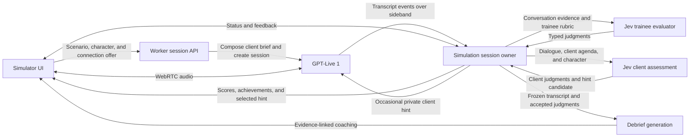

# The simulator: product and architecture proposal

Status: MVP design, updated September 25, 2026 with the product decisions below. This document is based on the current local application, anonymized consultancy context, and current provider documentation. The MVP now implements this design; current verification and remaining limits are recorded in the progress log.

Implementation is now authorized under the [MVP implementation plan](simulator-implementation-plan.md), which is the acceptance contract. This proposal provides design rationale and includes optional extensions beyond that contract. The [progress log](simulator-progress.md) owns current completion and verification status.

## Agreed direction

- Call the module **the simulator**.
- Support consultancy and sales simulations, with a built-in sales scenario in the first pass. The proposed starting catalog is one engineering scope scenario and one SharePoint sales scenario.
- Make **live Jev scores, visual objective progress, and live hints** central to the experience and demo.
- Give the client a separate private hint stream: Jev assesses its interests, behavior, and decision boundaries; the application selects an occasional authored cue for the voice actor. Keep trainee coaching and client direction separate. Cue delivery and its effect on natural conversation require voice testing.
- Use seven shared consulting and sales skills: **Credibility, Confidence, Listening, Rapport, Clarity, Guidance, and Adaptability**.
- Score how effectively the trainee is working with the particular client, using both the trainee's behavior and the client's responses. A difficult client can produce lower scores when the interaction is not connecting; that difficulty is part of the exercise.
- Show every objective from the start in a stable display order. Evaluate each independently so objectives can be achieved in any conversational order.
- Use GPT-Live 1 for all conversational audio and transcription. Do not add Flux to this path.
- Start with private practice. Manager assessment and sharing workflows are outside the MVP.
- Give the trainee a short, realistic lead rather than a detailed answer sheet.
- Author client backgrounds and explicit reactions to confidence, hesitation, forcefulness, interruptions, and other conversational behavior. GPT-Live hears the audio and plays those reactions directly.
- **Resistance follows the client's interests.** Make this the governing role-play principle: objections, disclosures, negotiating moves, concessions, and commitments follow what the client wants to gain or protect. Clients pursue their own business objectives and retain real constraints even when the conversation becomes friendly.
- Use stable character stats for assertiveness, skepticism, guardedness, bargaining drive, risk aversion, and relationship orientation. Stats shape how clients pursue their interests; scenario-specific agendas explain why. Numeric profiles and behavioral anchors need voice testing and tuning.
- Keep client characters separate from scenarios and combine them when an exercise starts. Reuse a small cast across sales and consultancy situations.
- Keep useful general consultancy and service context, while omitting company names, identifying internal team labels, and internal source paths from this public repository and its artwork.
- Use whole-scenario restart for retry. Keep scenario authoring and formal practitioner calibration for after the MVP; basic behavior and provider verification remain part of the build.

## Product premise

Add a practice mode in which a consultant or salesperson conducts a realistic conversation with a simulated client. The trainee gets a situation and an objective. The client has its own circumstances, knowledge, personality, and decision boundaries. A separate evaluator observes the conversation and produces useful coaching.

The two quality goals are independent:

1. **A convincing conversation.** The client listens, interrupts naturally, remembers what has happened, protects its interests, and changes its position for believable reasons. This must work with scoring disabled.
2. **Credible coaching.** Shared skill judgments and scenario-specific objective checks identify what the trainee did well, what they missed, and what to try differently, with actual conversation evidence. Skill judgments reflect how the interaction is landing with the selected client. These judgments must be testable against recorded transcripts without a live client.

A useful first flow is: choose scenario and client character → read a short lead → converse while skill bars, discoveries, and hints update → end conversation → review key moments → restart. Use a roughly 5–10 minute exercise as the initial duration assumption, representing one bounded meeting and an appropriate next step rather than an entire sales cycle. The timebox does not force success or impose a minimum number of turns before a commitment can be earned. Restart preserves the selected scenario and character; choosing a different client starts a fresh attempt of the same scenario.

Use the SharePoint opportunity as the first complete demonstration, then apply the same structure to the engineering scenario. A scenario editor, generated scenario catalog, manager dashboard, and numerical client-emotion engine are later possibilities, not prerequisites.

## Scenarios, characters, and exercises

Keep three small concepts explicit:

| Concept | Owns |
| --- | --- |
| Scenario | Business situation, company/project facts, client role and authority, private agenda and stakes, disclosure conditions, constraints, concerns, negotiating moves, acceptable commitments, trainee lead, objectives in display order, rubric, and hints |
| Client character | Reusable identity and background, behavioral traits, communication style, default voice, what earns trust, what provokes resistance, and reactions to vocal/conversational behavior |
| Exercise | One selected scenario and character, their versions, and the state of the current attempt |

The scenario supplies the client's role in this engagement and the facts they can know or reveal. The character determines how that person expresses those facts, handles pressure, and responds to the trainee. Keep engagement-specific facts and authority in the scenario; a personality swap must not invent a budget, grant purchasing authority, or change the underlying business problem.

Compose the actor brief from the scenario's client context plus the selected character. Give the trainee evaluator the scenario rubric and the relevant character behavior context so it can judge adaptation. Keep trainee objectives, grader criteria, and score history outside the actor prompt. The actor knows its own business objectives and receives occasional private client hints. Simple typed definitions and prompt composition are sufficient; this does not require a generic character engine or per-pair scripts.

### What each participant receives

| Part | Contents | Who receives it |
| --- | --- | --- |
| Trainee brief | Trainee role, short lead, known project facts, meeting context, broad objective, and optional service reference card | Trainee and evaluator |
| Client brief | Character identity and reaction rules combined with scenario role, responsibilities, pressures, private concerns, disclosure conditions, and limits on agreements | Voice actor; evaluator where needed to interpret the scenario |
| Rubric and objectives | Observable skill definitions, performance levels, applicability rules, discoverable facts, earned behaviors, outcomes, and serious mistakes | Evaluator; broad skill and objective labels are visible to the trainee |
| Private client hint | A brief authored cue about a current client interest, concern, justified concession, or decision boundary; no numeric grades or trainee coaching | Voice actor; application retains the selection and evidence for verification |
| Session settings | Selected character and voice, duration limit, scenario/character/rubric versions | Application |

Keep these as explicit projections of the server-owned scenario and character definitions. Do not serialize the complete definitions into the browser or the voice prompt. Company information is optional context attached to a scenario; the client should know only what that particular client plausibly knows.

The voice actor should know what would make its character agree, disagree, disclose information, or change its mind. It should not receive the trainee's scoring rules, score history, or an instruction to help the trainee reach a target. For example, “you will consider a separate discovery meeting if the problem seems understood and existing delivery will be protected” is a plausible client boundary. “Help the salesperson earn a successful cross-sell” is a different instruction with the wrong incentive.

Use stable circumstances and constraints for difficulty. A more experienced client might ask for evidence or involve another decision maker. Difficulty should not simply mean hostility, and rapport should not automatically erase a genuine budget or delivery constraint.

The [scenario authoring framework](simulator-scenario-framework.md) develops this into seven reusable scenario primitives, the agreed six-trait character structure, and a complete fictional SharePoint example. Stable character ratings describe assertiveness, skepticism, guardedness, bargaining drive, risk aversion, and relationship orientation. Scenario-specific private goals supply the client's agenda. Conversation history carries disclosures, unresolved concerns, offers, and commitments. The ratings are authoring controls; they do not require a numerical emotion engine. Behavioral anchors and example values remain seed content to verify in voice testing.

### Client reaction profiles

Reaction rules describe what the client does during the conversation, including how it responds to delivery. They are part of the role prompt, not a numerical emotion simulator.

| Profile | Behavior and response rules |
| --- | --- |
| Direct, challenging client | Uses blunt questions and tests recommendations. Responds well to concise, confident pushback backed by a reason. Presses harder when answers are evasive. Proportionate counterpressure can earn respect; volume alone should not manufacture trust. |
| Reserved, cautious client | Needs room to finish and think. Provides less detail when rushed, repeatedly interrupted, or steamrolled. Opens up when the consultant leaves space, asks focused questions, and makes a recommendation without overpowering the discussion. |
| Skeptical, evidence-focused client | Asks for specifics and tests assumptions. Responds to clear reasoning, examples, and candid limits. Challenges confident claims that lack support; becomes more open when uncertainty is handled honestly. |

Start with these three reusable characters. With the two starting scenarios, this gives six exercise combinations without writing six separate scenarios. Supply scenario-specific pressures and limits when casting each character into the engagement. Test these rules against actual audio. They specify desired behavior, not a guarantee of consistent tone interpretation.

The seven skill categories and their core meanings stay consistent across clients. Earning a strong score can require different approaches: a brisk, direct recommendation might build Confidence with one client and feel pushy to another. Guidance includes useful assertiveness; Adaptability captures recognizing the reaction and changing approach. Rapport reflects whether the connection is actually developing, so polite behavior can still accompany a low score when the conversation feels disconnected. Client difficulty is not normalized away.

## Two example scenarios

### Engineering: the small change that is not small

- **Trainee:** Technical lead on an existing software project. The client wants an additional reporting dashboard included in the current release.
- **Objective:** Understand the business need and agree on a credible next step while protecting delivery commitments.
- **Scenario client role:** An operations director under pressure to demonstrate progress who initially describes the request as minor. A coming executive review is the real concern. Relevant questions about timing and impact can expose that pressure; no particular phrase is required. The client would prefer to obtain the addition within the existing price and schedule. The selected character supplies identity and interpersonal behavior.
- **Business response:** Consider clear tradeoffs and practical options. Do not insist on the full dashboard if a smaller deliverable actually meets the need. The selected character determines how directly the client challenges an unexplained refusal or requests more detail.
- **Possible outcomes:** A scoped follow-up, an explicit priority tradeoff, or an agreed discovery task. A friendly promise to absorb unestimated work is not a good outcome.

### Sales: the adjacent SharePoint opportunity

- **Lead shown to the trainee:** “We're already delivering a custom software project for this client. We think there may be a SharePoint opportunity too. Use this check-in to understand whether there's a problem we can help with.”
- **Trainee:** An account representative at the consultancy in a check-in about the existing engagement.
- **Objective:** Discover whether there is a relevant need and earn an appropriate next step with the modern work team.
- **Scenario client role:** An IT leader with an established relationship with the current engineering team. The proposed private brief includes a previous rollout that failed to gain adoption, limited assessment authority, and an interest in obtaining planning help through the existing project. The specific difficulty and business impact emerge through conversation. The selected character determines how the client expresses interest, skepticism, or discomfort. See the [complete proposed example](simulator-scenario-framework.md#concrete-scenario-the-second-sharepoint-conversation) for fictional facts and disclosure conditions.
- **Business response:** Make the initial clue available early enough to create an opportunity. Evaluate proposed help against the actual need and constraints. Discussing capabilities early is allowed; resist unsupported commitments or irrelevant pressure rather than enforcing a prescribed sales sequence. A separate stakeholder may control funding.
- **Possible outcomes:** A discovery meeting with the right person, permission to send a relevant follow-up, or a well-founded decision that there is no current opportunity. Selling an implementation immediately need not be the objective.

The simulator should report **conversation outcome** separately from **skill performance**. A client can reasonably decline because of a budget or delivery constraint despite a strong interaction. A trainee can get agreement by overpromising and still perform poorly. This separation does not exclude the client's reactions from skill scoring: difficulty earning trust, connection, or a productive dialogue can lower the relevant scores.

### Anonymous consultancy context for the first sales scenario

Retain useful, non-identifying company details in this service card:

- The trainee works for a business and technology solutions consultancy.
- The consultancy develops custom software and modern applications on Azure.
- It also offers SharePoint and workplace collaboration services.
- Its capabilities include adoption support and change management.

This supports a realistic handoff from an existing custom software relationship to a SharePoint/collaboration discovery conversation. Company names, internal team labels, and identifying source links are omitted. The card describes broad capabilities rather than a specific package, price, availability, or delivery commitment. The client and its problems remain fictional scenario material.

For the sales demo, give the client a few discoverable facts: teams cannot find the authoritative document version, that creates repeated rework, a business team owns the pain, and a separate stakeholder must join a discovery meeting. Exact details remain fictional and versioned with the scenario.

## Live experience and discovery objectives

Use three complementary live UI elements:

1. **Skill bars:** Show all seven shared skills in a consistent order: Credibility, Confidence, Listening, Rapport, Clarity, Guidance, Adaptability. Use compact, anchored scores with meaningful labels; distinguish updating/unavailable readings from low performance.
2. **Discovery and achievement cards:** Show every objective in its authored display order from the start, and mark each as achieved when supported. Keep cards in their original positions as their state changes, with a short evidence excerpt available on inspection.
3. **One current hint:** A concise suggestion appropriate to the current gap, with a control to hide it. Place the hint above the objectives. The client keeps speaking in character; hints appear visually in the application.

Keep the live screen calm enough to use during a conversation. The [revised desktop mockup](../mockups/simulator-live-v4.png) uses three quiet columns: client and conversation on the left, hint and objectives in the middle, and seven skills on the right. Use smaller headings, slim score bars, and minimal framing. Keep all objectives visible in stable order; show detailed evidence on inspection. Put **THE SIMULATOR** in the top-right header position and omit the Private Practice badge. Private practice remains the product scope rather than a persistent UI label.

Present broad objectives such as “Find the business impact” without revealing the answer in advance. When achieved, the card can reveal what was learned. This supports the scavenger-hunt feel while preserving an authentic discovery conversation.

**Display order is not a required conversation sequence.** Every objective is eligible for evaluation from the beginning. There is no current step, prerequisite chain, or unlocking of the next objective. A trainee may identify the stakeholder first, discuss relevant capabilities before quantifying impact, or agree to a follow-up while other objectives remain incomplete. One exchange can satisfy multiple objectives.

Jev checks each objective against its own evidence criteria across the conversation. For example, a relevant capabilities discussion can count before business impact is known; a generic mention of SharePoint may still lack enough substance. That distinction comes from the objective's meaning, not whether earlier cards are complete. Assess any premature or pushy behavior through the contextual skill rubric, not by penalizing departure from list order.

| Sales objective | Evidence required |
| --- | --- |
| Understand the SharePoint problem | The conversation establishes a concrete problem; merely mentioning SharePoint is insufficient |
| Find the business impact | The client explains a consequence, such as lost time, rework, delays, or risk |
| Find the right stakeholder | The conversation identifies who owns the problem or must participate in the next step |
| Connect a relevant capability | The trainee connects the consultancy's SharePoint/collaboration capability to the expressed need without promising an unverified solution |
| Earn a next step | The client actually agrees to a relevant follow-up and the trainee establishes what happens next |

Keep three kinds of objective distinct: **discovery** (a fact became available), **behavior** (the trainee did something useful), and **outcome** (the conversation reached a state). If the client volunteers a fact, reveal the discovery without automatically granting listening/discovery skill credit; the trainee's follow-up determines that skill judgment.

Discoveries can remain visible once supported. Current agreements must be revised if the client later withdraws them. Do not award an objective repeatedly because the same evidence appears in successive snapshots. Partial speech, uncertain evidence, or a provider failure should not produce a completed badge.

Some skills also have concrete achievements:

| Skill | Example observable achievement |
| --- | --- |
| Guidance | Makes a clear recommendation and gives a relevant reason when a recommendation is called for |
| Adaptability | Revises a proposal in response to a newly stated constraint while retaining a useful path forward |
| Scope control | Makes a requested change's impact explicit before committing |
| Listening | Checks an interpretation and uses the client's clarification in the next response |

An earned behavior is evidence for a skill, not a permanent declaration that the trainee has mastered it. Keep the skill bar responsive to subsequent behavior.

## Rubric design

### Agreed default consulting and sales skills

Use these seven categories across clients and scenarios. Their definitions stay consistent; the selected client's responses and the developing interaction affect the judgments.

| Skill | What it captures |
| --- | --- |
| Credibility | Demonstrates understanding and gives the client reason to trust the advice. Relevant, grounded explanations and honest limits matter; technical-sounding claims alone are insufficient. |
| Confidence | Conveys that the trainee can handle the situation and provide a dependable way forward. This is the client-facing skill, distinct from the evaluator's confidence in its own judgment. |
| Listening | The client's concerns are understood and meaningfully addressed. Answers and recommendations use what the client actually said. |
| Rapport | The trainee is connecting with this client and establishing a productive working relationship. The quality of the connection matters, including when a difficult client is not responding well. |
| Clarity | Explanations and recommendations are understandable in the conversation. |
| Guidance | Moves the conversation somewhere useful while bringing the client along. Includes constructive recommendations, appropriate assertiveness, redirection, and useful next steps. |
| Adaptability | Recognizes when an approach is not landing and adjusts effectively as information, constraints, and client reactions emerge. |

These scores answer **how effectively am I working with this particular client?** They consider what the trainee does and how the interaction develops. They are not solely a checklist of behaviors performed correctly, and they do not normalize away client difficulty. The same polished pitch can earn different scores with different clients. A client remaining disconnected or unreassured can lower relevant skill scores even when the trainee was courteous.

Keep the dimensions distinct. A low Rapport score does not automatically lower every other score; a client may remain difficult while the trainee communicates clearly or adapts well. Client responses are evidence of the interaction, not direct commands to set a score. Unsupported claims, intimidation, or overpromising do not become good consulting merely because the client agrees.

Scenario-specific additions may include discovery, business relevance, scope control, and commitment management. These can supplement the shared foundation where the exercise calls for them. Keep aggression or disrespect as a separate negative behavior; low aggression is not the same as healthy assertiveness.

Use Jev **Score** for performance along descriptive levels and **Noul** for specific propositions, such as whether an unsupported delivery commitment was made. Noul is the probability that a proposition is true; it is not a percentage of skill. Score describes a position among defined levels. Preserve returned distributions and confidence where provided. [TypeSafe Score](https://docs.typesafe.ai/primitives/score), [TypeSafe Noul](https://docs.typesafe.ai/primitives/noul).

An illustrative scope-management scale, applicable after a request that threatens a commitment:

| Level | Observable behavior |
| --- | --- |
| 0 | Commits to the additional work within existing constraints without assessing or agreeing the impact |
| 1 | Signals uncertainty but leaves the client expecting the additional work within existing commitments |
| 2 | Clearly establishes that the request changes scope and requires an impact decision |
| 3 | Explains concrete delivery, cost, or priority tradeoffs that make the scope decision actionable |
| 4 | Establishes an explicit, mutually understood scope decision or an owned decision process before committing |

These anchors are draft hypotheses to calibrate with practitioners. Relationship quality and next-step completeness have their own dimensions. A rude refusal should not become excellent overall consulting because it protects scope.

Use a separate **not yet observable / insufficient evidence** status. It does not belong at the bottom of the skill scale. Judge what the trainee had a reasonable opportunity to address; do not penalize a failure to know a hidden fact the client never revealed or made discoverable. An early voluntary ending can still leave an objective incomplete without fabricating a low score for every skill.

GPT-Live hears the original audio and should enact the client's reaction to vocal and conversational behavior. Jev's initial scoring input is the Live transcript plus scenario context. It can assess phrasing, commitments, questions, and adaptation to the client's response; it does not directly hear vocal warmth, volume, or vocal stress. The MVP therefore needs no separate audio-scoring provider. Do not label a transcript-derived result as a direct measurement of vocal tone.

### Interruption events and observable overlap

The currently reviewed Live guides document interruption handling, but do not expose a dedicated “the user interrupted the assistant” notification to rely on. They expose timestamped input/output transcript fragments and distinguish transcript timing from playback. The Live prompting guide specifies how the model should yield to an interruption. [Live interruption behavior](https://developers.openai.com/api/docs/guides/live-prompting#interruptions), [transcript semantics](https://developers.openai.com/api/docs/guides/live-conversations#transcript-deltas).

Treat transcript overlap as an approximate observation, not a proven interruption or a quality penalty. If the demo needs an overlap indicator, compute candidate overlaps from the two timestamped streams and label them accordingly. More precise interruption measurement would combine local microphone voice activity, actual remote-audio playback activity, and conversational context. Local audio activity detection would not add another transcription provider, but is optional after the first working demo.

Brief acknowledgments, cooperative overlap, necessary correction, and repeatedly preventing the other person from speaking have different meanings. Use context when evaluating turn-taking. Do not carry over Realtime-specific event assumptions into the Live implementation.

## Architecture

Keep the existing Bun, React Router, React, TypeScript, and Cloudflare Workers application. Add `/simulator` as the new route. Give simulation its own lifecycle and scoring rules while sharing useful presentation and provider infrastructure.

The session owner holds the selected scenario and character, composed actor configuration, transcript events, evaluation revisions, independent objective states, private client assessments and hint delivery records, and session limits. It does not feed numeric grades or trainee coaching back into the actor. Its actor-facing context path carries selected client facts and private role-play cues. The two Jev boxes represent separate evaluation responsibilities using the same service, not a requirement for separate autonomous agents.

### Voice path

Use **`gpt-live-1` through the Live API**. GPT-Live is distinct from the older Realtime API; using the Realtime SDK examples as if they were the Live protocol would be an integration mistake. GPT-Live supports listening and speaking simultaneously. [GPT-Live overview](https://developers.openai.com/api/docs/guides/live), [model reference](https://developers.openai.com/api/docs/models/gpt-live-1).

The browser sends scenario/character IDs and an SDP connection offer to the Worker. The Worker resolves the server-owned definitions, composes the client brief, and creates the session through `POST /v1/live/sessions`, using an `OPENAI_API_KEY` secret. It returns the connection answer, and audio flows directly between browser and OpenAI over WebRTC. The key remains on the server. The current Flux transcription socket is not needed in this voice path. Project access to GPT-Live and the Worker/sideband connection still need a live spike. [Live WebRTC guide](https://developers.openai.com/api/docs/guides/voice-webrtc?api=live).

Prompt the actor with a concise identity, a few important facts, conversational style, reaction rules, decision boundaries, and disclosure conditions. Include explicit backchannel and interruption policies. It stays in the client role during the exercise; live coaching appears visually in the application. Prompts are a behavior hypothesis to test, not a guarantee that the model cannot break character. [GPT-Live prompting](https://developers.openai.com/api/docs/guides/live-prompting).

The first voice experiment needs no external business tools or company search. Use client delegation if backend assistance is needed, with a narrowly scoped handler for scenario facts. Any delegation must be handled explicitly; merely omitting delegation configuration selects client mode. Keep grader criteria out of this handler. Jev evaluation and private hint selection are independently scheduled by the application, never dependent on the voice actor asking to be evaluated. The lightweight client director below uses authored cues and application logic; add broader planning only if measured failures justify it. [Delegation guide](https://developers.openai.com/api/docs/guides/live-delegation).

### Private client assessment and hints

Use the same observe → judge → select a hint pattern as trainee coaching, with a different recipient and purpose. The client assessment receives dialogue from both speakers, the authored client interests and priorities, character traits, factual constraints, disclosure rules, and relevant earlier commitments. It does not consume the trainee's grades, objective completion, or coaching hints.

Separate **client objective progress** from **role fidelity**. Failing to extract free work can be a realistic concession that protects a more important interest. The director should keep resistance tied to interests and recognize earned progress; it must not maximize resistance, force the client to win, or change difficulty to chase a target trainee score. Character stats and business constraints stay fixed for the attempt.

Use narrow Jev questions: a Noul for a specific condition such as an unsupported commitment, a Score for an anchored degree of behavioral fidelity, and a Choice over applicable authored client hints plus `no_hint`. Batch independent questions over shared client context; questions in the same call cannot consume one another's answers. The application checks the candidate against factual limits, freshness, and any required condition judgments before selecting its authored text. A relative Choice win alone does not establish that an intervention is needed. Raw judgments remain in the application. This follows TypeSafe's separation of typed assessment from application-owned action. [TypeSafe primitives](https://docs.typesafe.ai/primitives), [Choice](https://docs.typesafe.ai/primitives/choice), [assessment-to-action example](https://docs.typesafe.ai/cookbooks/llm_guardrails).

Actor cues should be short context notes, such as: "Your adoption concern remains unresolved: the discussion has covered features but not ownership or working practices. A useful next topic is what would make this attempt different." After substantive evidence changes the situation, a later cue can recognize that the concern is addressed while retaining funding and authority limits. The actor chooses wording and timing in character; the cue is not a line to recite. See the [paired hint examples](simulator-scenario-framework.md#private-hints-for-the-client).

GPT-Live supports transcript-driven application work and returning context through the existing connection or server sideband without waiting for a delegation request. For ordinary client context, use `session.thinking.append` with `delegation_id: null`. It is not spoken automatically on arrival, but can influence later replies. Reserve `session.instructions.append` for deliberate corrective direction because it can interrupt ongoing speech or behavior. `session.commentary.append` is intended for content the model should speak and is unsuitable for private director notes. Each append accepts a plain string of up to 500 tokens; these cues should be much shorter. [Transcript-driven work](https://developers.openai.com/api/docs/guides/live-delegation#react-to-transcript-fragments), [update types](https://developers.openai.com/api/docs/guides/live-delegation#send-the-right-kind-of-update).

Keep the loop restrained:

- Evaluate meaningful accumulated exchanges, not individual transcript fragments. Evaluate as needed, but send a hint only when it adds useful direction. `no_hint` is a normal result.
- Send one focus at a time, with deduplication and a cooldown. A provisional starting point is client checks every 5–10 seconds of meaningful new dialogue and ordinary hints no more often than every 15–30 seconds; tune these values against actual conversations rather than treating them as provider guarantees.
- Retain the attempt, transcript revision, evidence, and selected hint ID. Discard results for ended attempts; reassess a cue if newer speech changes its premise. Keep only the latest unsent cue, not a backlog.
- State in the initial actor brief that private notes are temporary conversational context, never spoken coaching or authority to change the scenario. A newer note may supersede an earlier focus, but the append API does not remove prior notes from context. Avoid accumulating repeated or contradictory directions.
- Follow actual user speech over an outdated cue. Resolved concerns stay resolved unless new evidence reopens them. Send cues that allow concessions and disclosure as well as ones that preserve resistance.
- If client judging is uncertain, delayed, or unavailable, let the actor continue from its original brief. Jev's transcript judgments do not directly measure vocal tone.

Track append acknowledgments, but do not treat them as proof that the actor followed the hint. Context is injected over the session timeline, and the model may speak before using the complete update. Quiet context is also not a confidentiality boundary; keep trainee rubrics, grades, and application secrets out of it. An asynchronous cue cannot undo a disclosure or agreement already heard. Record that as an actor defect and evaluate subsequent behavior honestly. [Context delivery timing](https://developers.openai.com/api/docs/guides/live-conversations#understand-when-context-reaches-the-model), [context handling](https://developers.openai.com/api/docs/guides/live-delegation#send-the-right-kind-of-update).

### Session and transcript ownership

For the scored pilot, a **single Cloudflare Durable Object per attempt** is a reasonable new component: it owns the long-lived provider sideband, transcript revisions, and scheduling for both evaluation purposes. This gives those responsibilities one concrete owner. A voice-only connection spike can precede it using an ordinary Worker endpoint. Cloudflare supports outgoing WebSockets from Durable Objects; the active upstream connection must be included in runtime cost and lifecycle testing. [Cloudflare WebSockets](https://developers.cloudflare.com/durable-objects/best-practices/websockets/).

The backend attaches to `wss://api.openai.com/v1/live/sessions/{session_id}/attach` to observe the same session directly. Browser captions use the WebRTC data channel. Assign the backend ownership of judging and any actor-context updates to avoid duplicate actions. Attach before the exercise's opening exchange; retain or explicitly mark any observation gap. Grader criteria stay outside the Live session entirely; only selected client context and authored actor cues are sent back. Hiding the client brief from the practice UI is not a guarantee that a determined participant cannot inspect provider session events; formal assessment would require a separate integrity design. [Live server controls](https://developers.openai.com/api/docs/guides/voice-server-controls?api=live).

Live supplies `session.input_transcript.delta` and `session.output_transcript.delta` with approximate session-relative times. **It does not supply complete-turn events or exact word boundaries for these deltas.** Preserve original fragments, speaker identity, event IDs, and timestamps; group them separately for display. Both speakers can be active at once. A new Live adapter is required instead of reusing Flux's `EndOfTurn` assumptions. Transcript timing alone does not establish what the trainee actually heard. [Transcript semantics](https://developers.openai.com/api/docs/guides/live-conversations#transcript-deltas).

A session model needs attempt ID, selected scenario/character IDs and versions, rubric version, provider session ID, current lifecycle state, transcript revision, accepted evaluations, objective states keyed by objective ID, current hint, and usage. The scenario's objective array supplies stable display order; completion is not a progress cursor. A transcript fragment needs speaker, source ID, approximate start/end, and original text. An evaluation needs the attempt and transcript revision it assessed, dimension judgments, objective judgments, evidence references, and applicability status.

Durable Objects do not automatically make an exercise resumable. The first pilot can use transient conversation state and mark a failed connection incomplete. Saved history or reconnect recovery requires explicit persistence and a retention decision. Keep recording optional and separate from transcript storage.

### Evaluation path

1. Accumulate enough new speech to evaluate in context. Target visible updates roughly every 1–2 seconds when meaningful new evidence is arriving, then tune against actual provider latency. Either speaker can provide new scoring evidence: a client response can reveal whether the approach is connecting, as well as complete a discovery or confirm an outcome. Do not pretend a packet gap is a completed turn.
2. Send recent dialogue with both speakers clearly labeled, the seven shared skill definitions, any scenario additions, relevant character reaction rules, and relevant earlier commitments. Grade the trainee's effectiveness with this client using both behavior and how the interaction develops. Client speech can affect a relevant skill score; volunteering a fact does not automatically demonstrate the trainee's listening or discovery skill.
3. Batch independent skill Scores, objective Nouls, applicability questions, and serious-mistake checks over shared evidence. Evaluate objectives independently of their position in the list; multiple objectives may change in one update. Keep at most one request in flight for each evaluation purpose in an attempt and coalesce newer work. Client checks can run at their own slower cadence without blocking visible trainee feedback. No new evidence means no new score. [Composite scoring pattern](https://docs.typesafe.ai/patterns/composite-scoring).
4. Retain raw judgments and evidence references. Where a card needs supporting evidence, use a Choice question over identified conversation excerpts with a no-evidence option, and copy the selected text in code. The objective Noul establishes whether it was achieved; relative passage ranking alone does not establish achievement. Discard late results for an ended or superseded attempt; an older snapshot can remain historical without overwriting the current view. Missing or failed judgments remain unavailable, not zero.
5. At the end, freeze the transcript and evaluate the whole bounded exercise, reconciling earlier commitments, later corrections, and outcome. Do not average overlapping rolling snapshots into a final grade: the same evidence would be counted repeatedly.

Start with bounded 5–10 minute sessions and a tested text limit. For longer exercises, preserve explicit commitments and evidence-linked milestones rather than repeatedly resending an ever-growing transcript or trusting a lossy summary as the sole evidence.

A grading outage should allow the conversation to continue and mark feedback as delayed or unavailable. A voice outage affects the exercise itself. Keep these failure states separate.

Select live hints from authored scenario hints using the current conversational opportunity, objective gaps, and accepted judgments. Do not automatically select the first unchecked card or push the trainee back to the top of the list. For example, after the problem is known but its impact is missing, show “Ask what this is costing the team in their day-to-day work.” If the client is discussing ownership, a stakeholder hint may be more useful. This needs no prose-generation request for every score update. Keep one useful hint visible, avoid repeating achieved objectives, and never expose an undiscovered answer as a hint.

### Debrief path

Jev returns structured judgments rather than explanatory prose. First ship deterministic descriptions of rubric levels with selected transcript evidence. For tailored explanations and suggested alternative wording, make one separate text-generation request using the frozen transcript, rubric, and accepted judgments. The existing text-provider integration is a starting point for this call; it is not another voice turn.

Require passage IDs and validate that quoted evidence exists and belongs to the identified speaker. Copy quotes from source offsets instead of trusting regenerated wording. A generative explanation should not silently replace the recorded Jev score. Evidence selection needs a no-match result when nothing supports a claim.

A useful debrief contains the business outcome, two strengths, one or two concrete improvements, and a suggested phrase or question to try on the next attempt. Distinguish actual quotations from suggested alternatives. Session-level observations should not be presented as stable personality traits.

The debrief can also reveal the authored private agenda and explain how particular exchanges affected it. Keep those revelations out of live hints until supported by the conversation. Do not treat a hidden fact supplied to the evaluator as evidence that the trainee discovered it.

## Reuse from the application

| Current code | Reuse | Adaptation |
| --- | --- | --- |
| [Jev evaluator](../../ai/judging.ts) | TypeSafe provider, batched questions, validation, usage measurement | New rubric questions and richer judgment results; current validation expects exactly 42 characters |
| [Performance logic](../../core/performance.ts), [game hook](../../app/game/use-game.ts) | Attempt IDs, revision checks, stale-result rejection, cleanup patterns | New conversation evidence model; game streak and 70/30 probability blend are game-specific |
| [Highlight selection](../../ai/highlights.ts), [source passages](../../core/highlights.ts) | Selection from real passages and exact source offsets | Speaker-aware evidence for each rubric dimension and explicit no-evidence handling |
| [API boundary](../../app/server/api.ts) | Bounded inputs, server-owned model selection, origin checks, limits | Session endpoints, authorization, session ownership, and Live secret |
| [Speech bridge](../../app/server/speech.ts), [transcript adapter](../../app/audio/transcript.ts) | Lifecycle and cleanup lessons | A separate WebRTC/Live adapter; Flux wire format and audio pipeline do not transfer directly |
| [State machine](../../app/game/machine.ts), [workshop](../../app/routes/storybook.tsx), [eval runner](../../ai/evals/run.ts) | Lifecycle conventions, fixture-driven UI, reproducible provider experiments | Simulation fixtures, real conversation tests, and separate voice/scoring quality reports |

Likely additions are a simulator route and hook, a Live connection adapter, separate server-owned scenario and character definitions, a session coordinator, a rubric/objective evaluator, live score and objective components, and a debrief generator. Extract shared helpers only where there is actual repeated behavior; there is no need for a generalized plugin system.

The current app has no login or server-side transcript history. Private practice initially means individual results and no manager reporting. Keep session data transient and whole-scenario restart simple. Before making an internal hosted pilot available, choose a lightweight access mechanism and session duration/spend limits. Reuse existing secret handling and paid-service controls; a private-practice product mode alone is not access control.

GPT-Live voice usage is based on session duration; delegated text calls and Jev usage are separate. Collect actual usage and latency in the spike instead of applying the game's cost estimate. Muting input does not end the session. Close explicitly and receive `session.closed` before normal cleanup; if finalization fails, record it as incomplete. [Live session lifecycle](https://developers.openai.com/api/docs/guides/live-conversations#usage-and-graceful-close).

## Delivery and verification

1. **First complete demo:** Build the SharePoint sales scenario with a reusable client character, GPT-Live conversation, live Jev skill bars, objectives visible from the start, separate trainee and private client hints, and whole-scenario restart. Compare the actor with and without private cues during the voice experiment to tune the loop. A short voice-connection spike is an implementation step, not the MVP deliverable. Use fictional client facts and the anonymized consultancy service card.
2. **MVP behavior checks:** Use representative positive/negative transcript fixtures for objective completion and rubric behavior, including stakeholder-first discovery, capabilities before impact, several objectives satisfied together, incomplete speech, merely naming a goal, a client-volunteered fact, an unaccepted meeting proposal, a withdrawn agreement, and a trainee adapting to a new constraint. Include contrasting client reactions to a similar trainee approach, polite but disconnected exchanges, and recovery after an approach fails to land. Verify that the seven skill definitions remain consistent while relevant scores can differ with the interaction, without a low Rapport score automatically pulling every skill down. Verify stable objective display order and that hints follow context. Verify that trainee scores and hints never enter actor context, private client hints leave stats and constraints unchanged, stale or duplicate cues are suppressed, and uncertainty produces no intervention. Do not reuse the game's threshold or assume character-classification results transfer.
3. **Complete starting catalog:** Add the engineering scope scenario and the three reusable client characters, an evidence-linked recap, and UI workshop fixtures. Check that switching characters changes conversational behavior while preserving scenario facts, authority, and objective criteria. Test real microphone and speaker behavior, character-specific reactions, denied permissions, echo, overlapping speakers, slow grading, disconnects, ending during a request, and cleanup. Reuse the existing build/check suite once code is added; local tests alone do not establish voice realism.
4. **After MVP:** Recruit practitioners to supply and calibrate realistic examples, expand reaction profiles, and decide whether precise audio coaching, nontechnical scenario authoring, saved history, or facilitator features warrant additional work.

Track voice realism and grading quality separately. MVP evidence should cover observed character breaks, unsupported agreements, visible scoring latency, false objective completions, evidence coverage, cleanup, and actual session cost. Formal practitioner ratings and broader rubric calibration follow after MVP. This proposal does not claim these checks have passed.

Use the framework's [role-play probes](simulator-scenario-framework.md#reuse-and-verification) to check both resistance and responsiveness: a generic pitch should not buy an unsupported agreement, and a substantive approach should be able to earn progress. Verify that factual limits persist, legitimate direct questions can receive useful answers, resolved concerns stay resolved, and the actor does not require objectives in list order. An actor inventing authority or handing out an unearned commitment is a simulation defect, not proof of trainee skill.

Compare matched conversations with client hints enabled and disabled. Check for fewer unsupported concessions, appropriate easing after concerns are addressed, fewer repeated objections, and preserved natural speech. Inspect unexpected interruptions, spoken director notes, delayed cues after the topic changes, and additional latency/cost. Judge against authored expectations and actual dialogue; the client director's own approval is not independent proof that the loop improved role-play. The trainee evaluator must use conversation evidence rather than inherit the director's conclusions.

## Remaining implementation choices

Use reasonable defaults for the fictional character identities, voices, visual presentation, and initial score anchors. Confirm GPT-Live account access and observe the actual Live event stream during the implementation spike. Whole-scenario restart, transient results, authored scenario/character definitions and hints, and a small bounded context keep the first build straightforward. No additional product questionnaire is needed before turning this design into an implementation plan.
